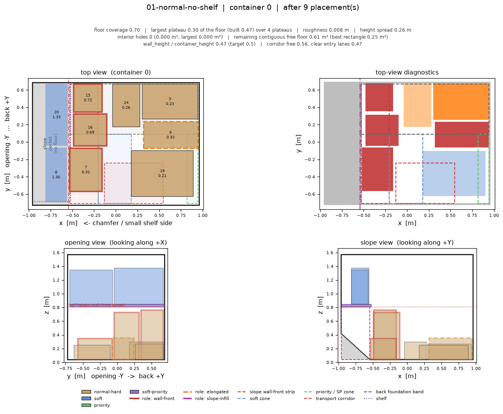
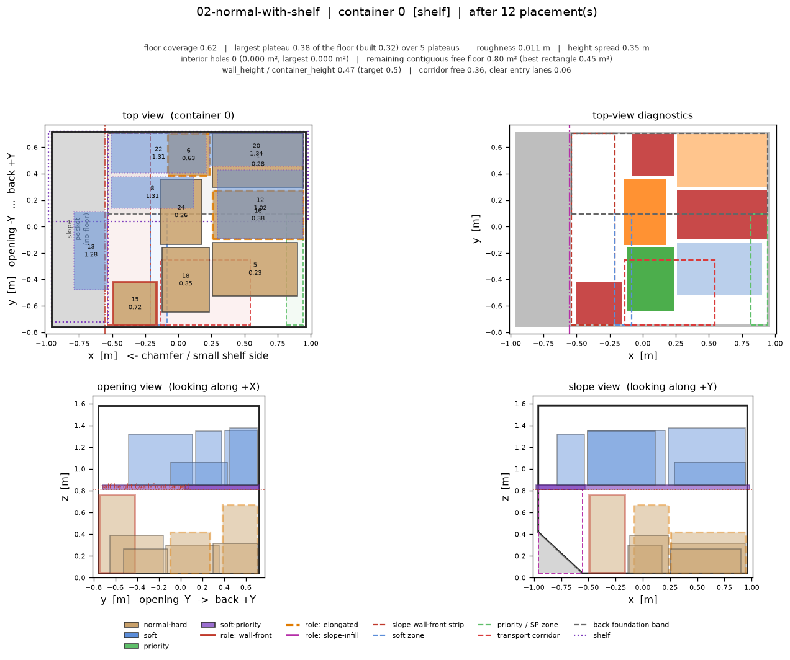
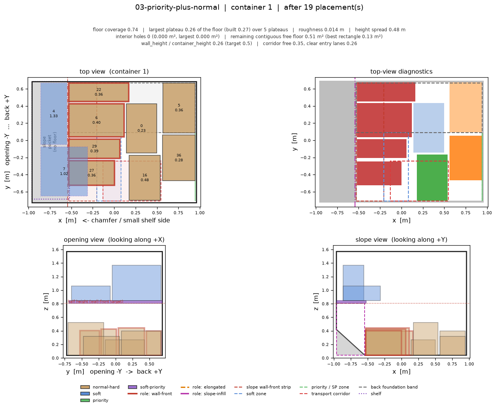
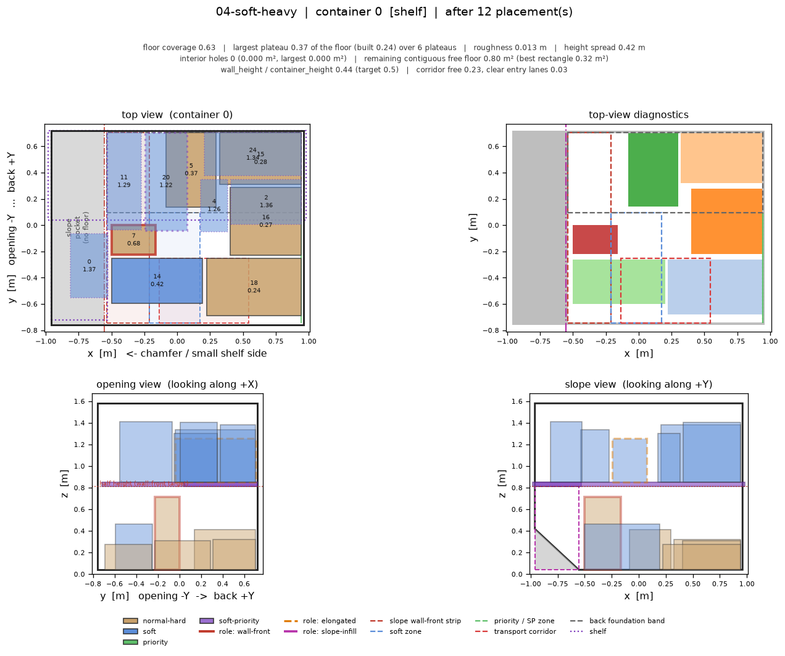
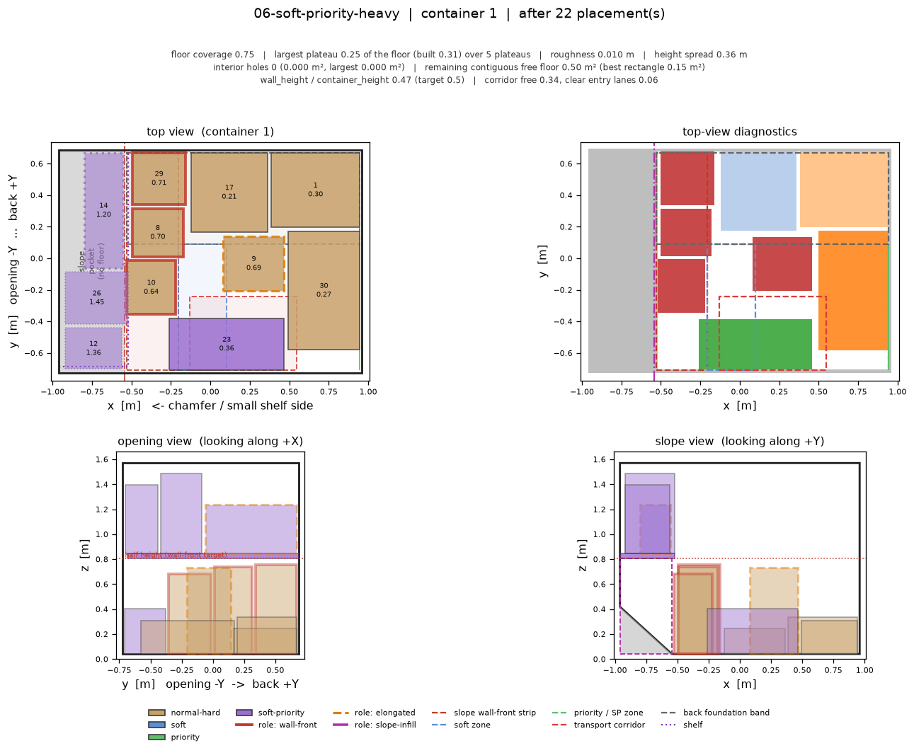
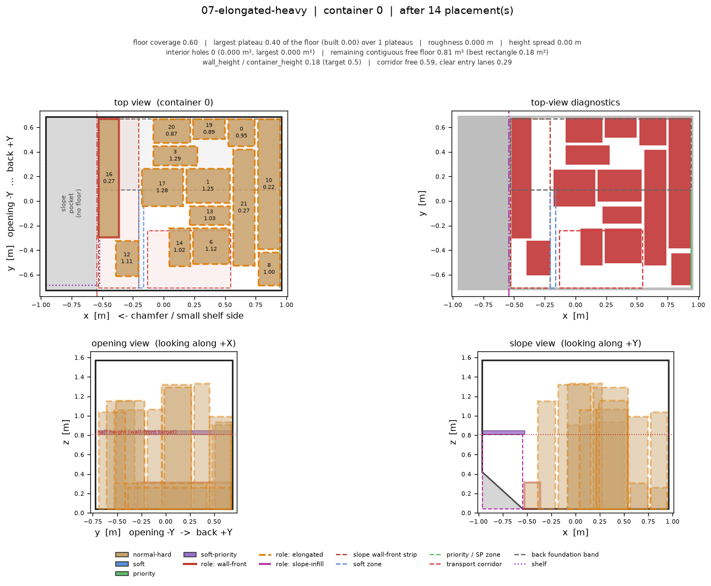
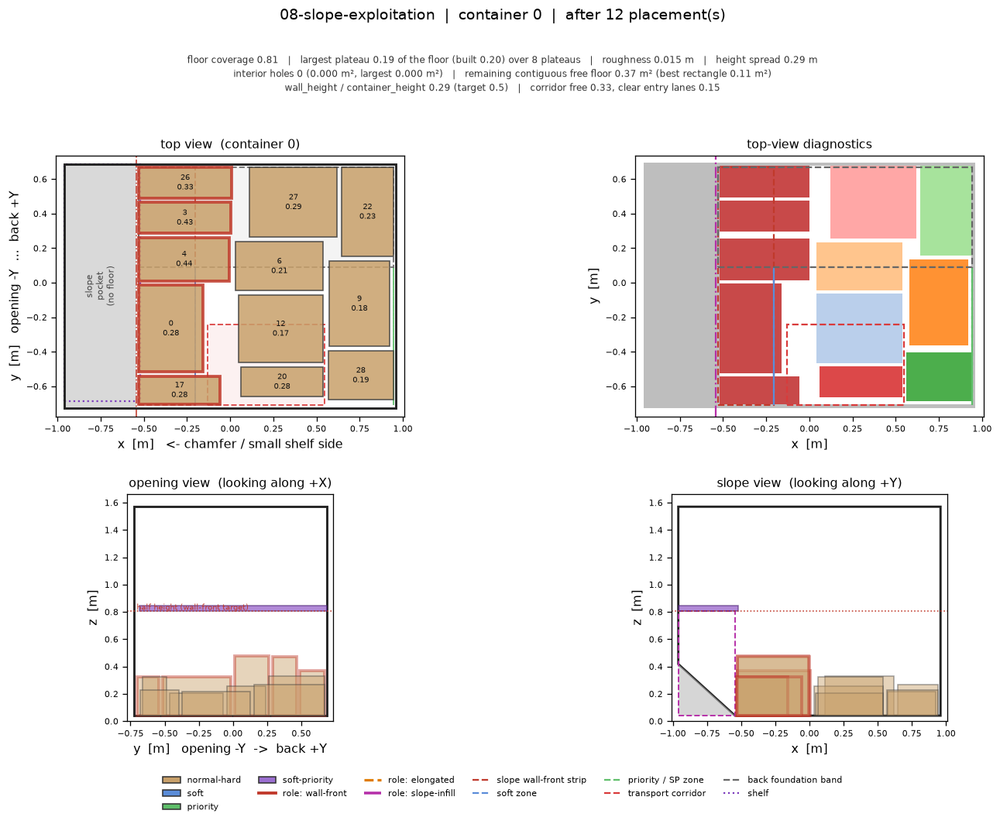
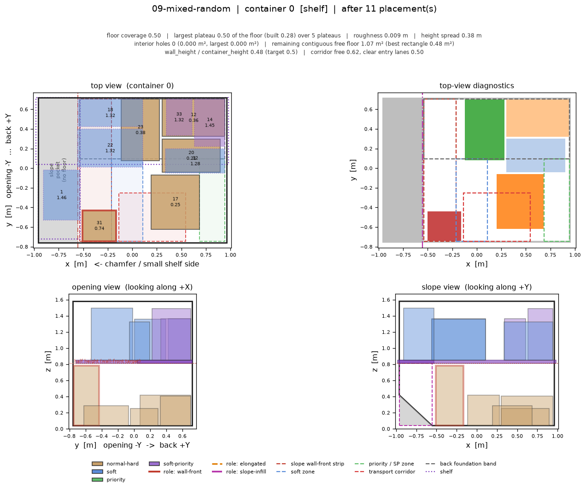
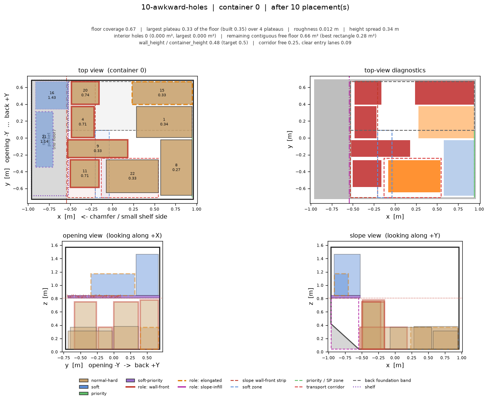
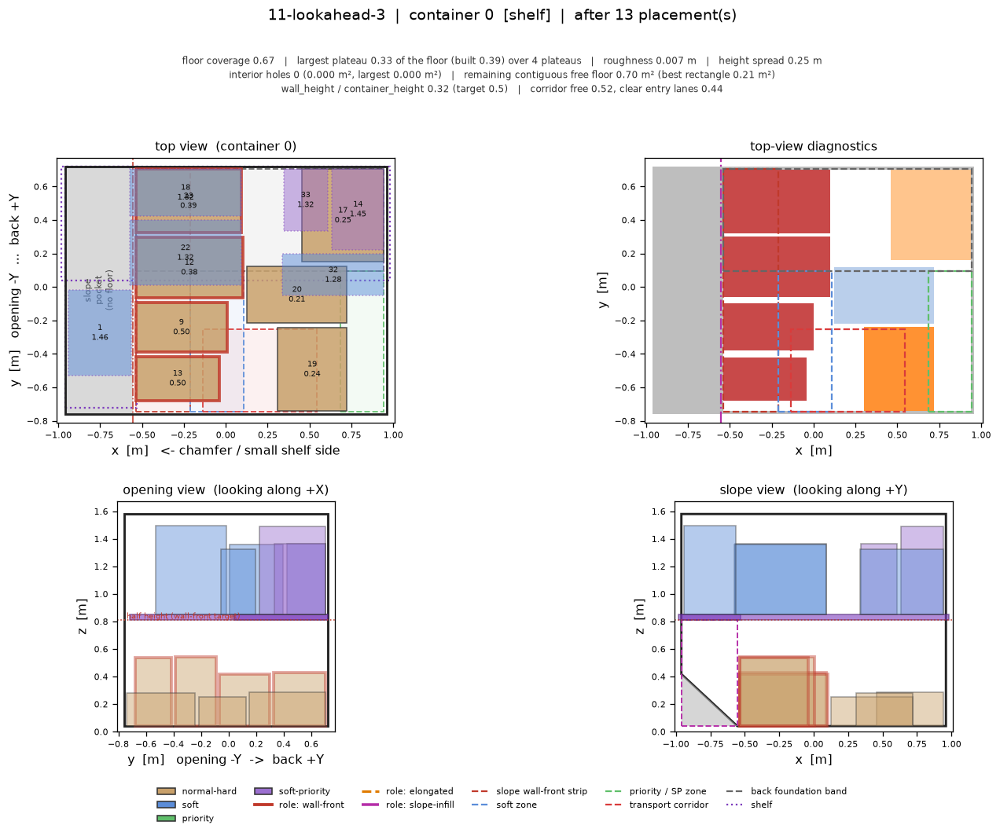

# rule-alpha Layer 1 — scenario report

Generated by `python3 -m rule_alpha.runner`.  Every number below is a *diagnostic*, not an objective: rule-alpha is a rule-based Layer 1 prototype whose purpose is to be looked at.

See `docs/rule_alpha/README.md` for the rules, the classification and how to read the pictures.

## Per-scenario headline

| scenario | placed / stream | floor cov. | largest plateau (of floor) | largest built plateau (of built) | plateaus | roughness | interior holes | largest hole | free rect | wall h/H | corridor lanes |
|---|---|---|---|---|---|---|---|---|---|---|---|
| 01-normal-no-shelf | 9/26 | 0.70 | 0.30 | 0.47 | 4 | 0.008 | 0 | 0.000 | 0.25 | 0.47 | 0.47 |
| 02-normal-with-shelf | 12/26 | 0.62 | 0.38 | 0.32 | 5 | 0.011 | 0 | 0.000 | 0.45 | 0.47 | 0.06 |
| 03-priority-plus-normal (c0·P) | 19/40 | 0.58 | 0.42 | 0.49 | 4 | 0.007 | 0 | 0.000 | 0.30 | 0.30 | 0.09 |
| 03-priority-plus-normal (c1·N) | 19/40 | 0.74 | 0.26 | 0.27 | 5 | 0.014 | 0 | 0.000 | 0.13 | 0.26 | 0.26 |
| 04-soft-heavy | 12/26 | 0.63 | 0.37 | 0.24 | 6 | 0.013 | 0 | 0.000 | 0.32 | 0.44 | 0.03 |
| 05-priority-heavy-no-priority-uld | 9/26 | 0.79 | 0.21 | 0.36 | 5 | 0.015 | 0 | 0.000 | 0.12 | 0.48 | 0.03 |
| 06-soft-priority-heavy (c0·P) | 22/34 | 0.53 | 0.47 | 0.29 | 5 | 0.012 | 0 | 0.000 | 0.37 | 0.00 | 0.03 |
| 06-soft-priority-heavy (c1·N) | 22/34 | 0.75 | 0.25 | 0.31 | 5 | 0.010 | 0 | 0.000 | 0.15 | 0.47 | 0.06 |
| 07-elongated-heavy | 14/22 | 0.60 | 0.40 | 0.00 | 1 | 0.000 | 0 | 0.000 | 0.18 | 0.18 | 0.29 |
| 08-slope-exploitation | 12/30 | 0.81 | 0.19 | 0.20 | 8 | 0.015 | 0 | 0.000 | 0.11 | 0.29 | 0.15 |
| 09-mixed-random | 11/34 | 0.50 | 0.50 | 0.28 | 5 | 0.009 | 0 | 0.000 | 0.48 | 0.48 | 0.50 |
| 10-awkward-holes | 10/26 | 0.67 | 0.33 | 0.35 | 4 | 0.012 | 0 | 0.000 | 0.28 | 0.48 | 0.09 |
| 11-lookahead-3 | 13/34 | 0.67 | 0.33 | 0.39 | 4 | 0.007 | 0 | 0.000 | 0.21 | 0.32 | 0.44 |
| 12-large-hard-only | 4/20 | 0.80 | 0.21 | 0.26 | 5 | 0.009 | 0 | 0.000 | 0.18 | 0.00 | 0.03 |

## Scenarios

### 01-normal-no-shelf

Single ULD without a shelf, mostly plain hard cargo. The reference picture for the rectangular floor rule.

- stream: 26 items, placed 9, left for Layer 2+ 17
- stop reason: `stream-exhausted`
- roles: `{'wall-front': 3, 'none': 5, 'elongated': 1}`
- winning archetypes: `{'wall-front': 3, 'max-footprint': 3, 'elongated-wall': 1, 'shelf-space-saving': 2}`
- placed by class/surface: `{'normal-hard/floor': 7, 'soft/shelf': 2}`

**container 0**

- floor coverage `0.699`, largest plateau `0.301` of the usable floor (largest *built* plateau `0.4661` of the built surface) over `4` plateaus, height spread `0.256` m, local roughness `0.0081` m
- structural cells masked out of flatness: `0.3004`
- interior holes `0` totalling `0` m², largest `0.0` m²
- remaining contiguous free floor `0.6064` m² (largest inscribed rectangle `0.2464` m²)
- slope wall front: `3` items, wall_height / container_height = `0.4699`
- transport corridor free `0.5627`, clear entry lanes `0.4706`
- typed support area: `{'hard': 1.4084}`
- zone occupancy: `wall_front_strip` 0.79, `soft_zone` 0.11, `priority_zone` 0.63, `corridor` 0.44, `back_band` 0.83, `centre_band` 0.85



Intermediate steps: [c0_step000](images/01-normal-no-shelf/c0_step000.png), [c0_step002](images/01-normal-no-shelf/c0_step002.png), [c0_step004](images/01-normal-no-shelf/c0_step004.png), [c0_step007](images/01-normal-no-shelf/c0_step007.png), [c0_step009](images/01-normal-no-shelf/c0_step009.png)

### 02-normal-with-shelf

Same cargo mix in a shelf ULD: shows where the soft items go once a shelf exists, and what the shelf does to the back half of the floor.

- stream: 26 items, placed 12, left for Layer 2+ 14
- stop reason: `stream-exhausted`
- roles: `{'wall-front': 1, 'none': 9, 'elongated': 2}`
- winning archetypes: `{'wall-front': 1, 'max-footprint': 4, 'elongated-wall': 2, 'shelf-space-saving': 5}`
- placed by class/surface: `{'normal-hard/floor': 7, 'soft/shelf': 5}`

**container 0** · shelf

- floor coverage `0.6242`, largest plateau `0.3758` of the usable floor (largest *built* plateau `0.316` of the built surface) over `5` plateaus, height spread `0.348` m, local roughness `0.0109` m
- structural cells masked out of flatness: `0.2203`
- interior holes `0` totalling `0` m², largest `0.0` m²
- remaining contiguous free floor `0.8008` m² (largest inscribed rectangle `0.448` m²)
- slope wall front: `1` items, wall_height / container_height = `0.4669`
- transport corridor free `0.3578`, clear entry lanes `0.0588`
- typed support area: `{'hard': 1.3304}`
- zone occupancy: `wall_front_strip` 0.19, `soft_zone` 0.45, `priority_zone` 0.56, `corridor` 0.64, `back_band` 0.65, `centre_band` 0.81



Intermediate steps: [c0_step000](images/02-normal-with-shelf/c0_step000.png), [c0_step003](images/02-normal-with-shelf/c0_step003.png), [c0_step006](images/02-normal-with-shelf/c0_step006.png), [c0_step009](images/02-normal-with-shelf/c0_step009.png), [c0_step012](images/02-normal-with-shelf/c0_step012.png)

### 03-priority-plus-normal

Priority ULD (index 0) next to a normal ULD. Tests the routing rules: soft-only never enters the priority container, plain hard may but only inside its budget.

- stream: 40 items, placed 19, left for Layer 2+ 21
- stop reason: `stream-exhausted`
- roles: `{'wall-front': 6, 'none': 11, 'elongated': 2}`
- winning archetypes: `{'wall-front': 6, 'max-footprint': 8, 'shelf-space-saving': 5}`
- placed by class/surface: `{'normal-hard/floor': 13, 'priority/floor': 1, 'soft-priority/shelf': 3, 'soft/shelf': 2}`

**container 0** · priority · shelf

- floor coverage `0.5794`, largest plateau `0.4206` of the usable floor (largest *built* plateau `0.4878` of the built surface) over `4` plateaus, height spread `0.331` m, local roughness `0.0074` m
- structural cells masked out of flatness: `0.2023`
- interior holes `0` totalling `0` m², largest `0.0` m²
- remaining contiguous free floor `0.8964` m² (largest inscribed rectangle `0.3036` m²)
- slope wall front: `2` items, wall_height / container_height = `0.2961`
- transport corridor free `0.5061`, clear entry lanes `0.0882`
- typed support area: `{'hard': 1.126, 'priority-only': 0.1088}`
- zone occupancy: `wall_front_strip` 0.43, `soft_zone` 0.00, `priority_zone` 0.79, `corridor` 0.49, `back_band` 0.65, `centre_band` 0.60

**container 1**

- floor coverage `0.7445`, largest plateau `0.2555` of the usable floor (largest *built* plateau `0.2684` of the built surface) over `5` plateaus, height spread `0.48` m, local roughness `0.0141` m
- structural cells masked out of flatness: `0.3369`
- interior holes `0` totalling `0` m², largest `0.0` m²
- remaining contiguous free floor `0.5148` m² (largest inscribed rectangle `0.126` m²)
- slope wall front: `4` items, wall_height / container_height = `0.2627`
- transport corridor free `0.3453`, clear entry lanes `0.2647`
- typed support area: `{'hard': 1.5}`
- zone occupancy: `wall_front_strip` 0.81, `soft_zone` 0.58, `priority_zone` 0.00, `corridor` 0.65, `back_band` 0.84, `centre_band` 0.72



Intermediate steps: [c0_step000](images/03-priority-plus-normal/c0_step000.png), [c1_step000](images/03-priority-plus-normal/c1_step000.png), [c0_step005](images/03-priority-plus-normal/c0_step005.png), [c1_step005](images/03-priority-plus-normal/c1_step005.png), [c0_step010](images/03-priority-plus-normal/c0_step010.png), [c1_step010](images/03-priority-plus-normal/c1_step010.png), [c0_step014](images/03-priority-plus-normal/c0_step014.png), [c1_step014](images/03-priority-plus-normal/c1_step014.png), [c0_step019](images/03-priority-plus-normal/c0_step019.png), [c1_step019](images/03-priority-plus-normal/c1_step019.png)

### 04-soft-heavy

Soft-dominated stream into a shelf ULD: shelf saturates early, the rest must cluster on the left soft strip.

- stream: 26 items, placed 12, left for Layer 2+ 14
- stop reason: `stream-exhausted`
- roles: `{'wall-front': 1, 'none': 10, 'elongated': 1}`
- winning archetypes: `{'wall-front': 1, 'max-footprint': 4, 'shelf-space-saving': 6, 'soft-edge': 1}`
- placed by class/surface: `{'normal-hard/floor': 5, 'soft/shelf': 6, 'soft/floor': 1}`

**container 0** · shelf

- floor coverage `0.6258`, largest plateau `0.3742` of the usable floor (largest *built* plateau `0.2402` of the built surface) over `6` plateaus, height spread `0.425` m, local roughness `0.0128` m
- structural cells masked out of flatness: `0.0351`
- interior holes `0` totalling `0` m², largest `0.0` m²
- remaining contiguous free floor `0.7976` m² (largest inscribed rectangle `0.322` m²)
- slope wall front: `1` items, wall_height / container_height = `0.439`
- transport corridor free `0.2341`, clear entry lanes `0.0294`
- typed support area: `{'hard': 1.0956, 'soft-only': 0.238}`
- zone occupancy: `wall_front_strip` 0.34, `soft_zone` 0.44, `priority_zone` 0.00, `corridor` 0.77, `back_band` 0.61, `centre_band` 0.81



Intermediate steps: [c0_step000](images/04-soft-heavy/c0_step000.png), [c0_step003](images/04-soft-heavy/c0_step003.png), [c0_step006](images/04-soft-heavy/c0_step006.png), [c0_step009](images/04-soft-heavy/c0_step009.png), [c0_step012](images/04-soft-heavy/c0_step012.png)

### 05-priority-heavy-no-priority-uld

Priority-dominated stream with no priority ULD: the priority edge zone on the right is the only home.

- stream: 26 items, placed 9, left for Layer 2+ 17
- stop reason: `stream-exhausted`
- roles: `{'wall-front': 3, 'none': 4, 'elongated': 2}`
- winning archetypes: `{'wall-front': 3, 'max-footprint': 4, 'priority-edge': 2}`
- placed by class/surface: `{'normal-hard/floor': 7, 'priority/floor': 2}`

**container 0**

- floor coverage `0.7923`, largest plateau `0.2077` of the usable floor (largest *built* plateau `0.3558` of the built surface) over `5` plateaus, height spread `0.393` m, local roughness `0.0151` m
- structural cells masked out of flatness: `0.2835`
- interior holes `0` totalling `0` m², largest `0.0` m²
- remaining contiguous free floor `0.4184` m² (largest inscribed rectangle `0.1168` m²)
- slope wall front: `3` items, wall_height / container_height = `0.485`
- transport corridor free `0.1982`, clear entry lanes `0.0294`
- typed support area: `{'hard': 1.4564, 'priority-only': 0.14}`
- zone occupancy: `wall_front_strip` 0.82, `soft_zone` 0.00, `priority_zone` 0.59, `corridor` 0.80, `back_band` 0.87, `centre_band` 0.81


Intermediate steps: [c0_step000](images/05-priority-heavy-no-priority-uld/c0_step000.png), [c0_step002](images/05-priority-heavy-no-priority-uld/c0_step002.png), [c0_step004](images/05-priority-heavy-no-priority-uld/c0_step004.png), [c0_step007](images/05-priority-heavy-no-priority-uld/c0_step007.png), [c0_step009](images/05-priority-heavy-no-priority-uld/c0_step009.png)

### 06-soft-priority-heavy

Soft+priority dominated stream with a priority shelf ULD present: SP should prefer the priority shelf, then cluster.

- stream: 34 items, placed 22, left for Layer 2+ 12
- stop reason: `stream-exhausted`
- roles: `{'none': 17, 'wall-front': 3, 'elongated': 2}`
- winning archetypes: `{'wall-front': 3, 'max-footprint': 4, 'elongated-wall': 1, 'shelf-space-saving': 10, 'sp-cluster': 4}`
- placed by class/surface: `{'normal-hard/floor': 8, 'soft-priority/shelf': 10, 'soft-priority/floor': 4}`

**container 0** · priority · shelf

- floor coverage `0.5285`, largest plateau `0.4715` of the usable floor (largest *built* plateau `0.2884` of the built surface) over `5` plateaus, height spread `0.52` m, local roughness `0.0121` m
- structural cells masked out of flatness: `0.0`
- interior holes `0` totalling `0` m², largest `0.0` m²
- remaining contiguous free floor `1.0048` m² (largest inscribed rectangle `0.3744` m²)
- slope wall front: `0` items, wall_height / container_height = `0.0`
- transport corridor free `0.2096`, clear entry lanes `0.0294`
- typed support area: `{'hard': 0.2944, 'soft+priority-only': 0.832}`
- zone occupancy: `wall_front_strip` 0.12, `soft_zone` 0.00, `priority_zone` 0.41, `corridor` 0.79, `back_band` 0.50, `centre_band` 0.68

**container 1**

- floor coverage `0.7526`, largest plateau `0.2474` of the usable floor (largest *built* plateau `0.3115` of the built surface) over `5` plateaus, height spread `0.361` m, local roughness `0.0101` m
- structural cells masked out of flatness: `0.2198`
- interior holes `0` totalling `0` m², largest `0.0` m²
- remaining contiguous free floor `0.4984` m² (largest inscribed rectangle `0.1456` m²)
- slope wall front: `3` items, wall_height / container_height = `0.4667`
- transport corridor free `0.3427`, clear entry lanes `0.0588`
- typed support area: `{'hard': 1.286, 'soft+priority-only': 0.2304}`
- zone occupancy: `wall_front_strip` 0.71, `soft_zone` 0.43, `priority_zone` 0.00, `corridor` 0.66, `back_band` 0.88, `centre_band` 0.84



Intermediate steps: [c0_step000](images/06-soft-priority-heavy/c0_step000.png), [c1_step000](images/06-soft-priority-heavy/c1_step000.png), [c0_step006](images/06-soft-priority-heavy/c0_step006.png), [c1_step006](images/06-soft-priority-heavy/c1_step006.png), [c0_step011](images/06-soft-priority-heavy/c0_step011.png), [c1_step011](images/06-soft-priority-heavy/c1_step011.png), [c0_step016](images/06-soft-priority-heavy/c0_step016.png), [c1_step016](images/06-soft-priority-heavy/c1_step016.png), [c0_step022](images/06-soft-priority-heavy/c0_step022.png), [c1_step022](images/06-soft-priority-heavy/c1_step022.png)

### 07-elongated-heavy

Long thin cargo (rho 2.5-6): the structural exception path. Watch where the wall / corner preference sends them and which poses the tipping bands refuse.

- stream: 22 items, placed 14, left for Layer 2+ 8
- stop reason: `stream-exhausted`
- roles: `{'elongated': 13, 'wall-front': 1}`
- winning archetypes: `{'elongated-wall': 13, 'wall-front': 1}`
- placed by class/surface: `{'normal-hard/floor': 14}`

**container 0**

- floor coverage `0.5958`, largest plateau `0.4042` of the usable floor (largest *built* plateau `0.0` of the built surface) over `1` plateaus, height spread `0.0` m, local roughness `0.0` m
- structural cells masked out of flatness: `0.5958`
- interior holes `0` totalling `0` m², largest `0.0` m²
- remaining contiguous free floor `0.8144` m² (largest inscribed rectangle `0.18` m²)
- slope wall front: `1` items, wall_height / container_height = `0.1765`
- transport corridor free `0.5895`, clear entry lanes `0.2941`
- typed support area: `{'hard': 1.2004}`
- zone occupancy: `wall_front_strip` 0.48, `soft_zone` 0.09, `priority_zone` 0.00, `corridor` 0.41, `back_band` 0.68, `centre_band` 0.65



Intermediate steps: [c0_step000](images/07-elongated-heavy/c0_step000.png), [c0_step004](images/07-elongated-heavy/c0_step004.png), [c0_step007](images/07-elongated-heavy/c0_step007.png), [c0_step010](images/07-elongated-heavy/c0_step010.png), [c0_step014](images/07-elongated-heavy/c0_step014.png)

### 08-slope-exploitation

Small low boxes that would fit the chamfer wedge if it were reachable. This scenario exists to show whether the slope pocket is usable at all from a floor layer.

- stream: 30 items, placed 12, left for Layer 2+ 18
- stop reason: `stream-exhausted`
- roles: `{'wall-front': 5, 'none': 7}`
- winning archetypes: `{'wall-front': 5, 'max-footprint': 7}`
- placed by class/surface: `{'normal-hard/floor': 12}`

**container 0**

- floor coverage `0.8148`, largest plateau `0.1852` of the usable floor (largest *built* plateau `0.1965` of the built surface) over `8` plateaus, height spread `0.288` m, local roughness `0.0148` m
- structural cells masked out of flatness: `0.2843`
- interior holes `0` totalling `0` m², largest `0.0` m²
- remaining contiguous free floor `0.3732` m² (largest inscribed rectangle `0.112` m²)
- slope wall front: `5` items, wall_height / container_height = `0.2869`
- transport corridor free `0.3312`, clear entry lanes `0.1471`
- typed support area: `{'hard': 1.6416}`
- zone occupancy: `wall_front_strip` 0.93, `soft_zone` 0.00, `priority_zone` 0.00, `corridor` 0.67, `back_band` 0.85, `centre_band` 0.78



Intermediate steps: [c0_step000](images/08-slope-exploitation/c0_step000.png), [c0_step003](images/08-slope-exploitation/c0_step003.png), [c0_step006](images/08-slope-exploitation/c0_step006.png), [c0_step009](images/08-slope-exploitation/c0_step009.png), [c0_step012](images/08-slope-exploitation/c0_step012.png)

### 09-mixed-random

Realistic mixed stream matching the official sample config class ratios.

- stream: 34 items, placed 11, left for Layer 2+ 23
- stop reason: `stream-exhausted`
- roles: `{'wall-front': 1, 'none': 10}`
- winning archetypes: `{'wall-front': 1, 'max-footprint': 4, 'shelf-space-saving': 6}`
- placed by class/surface: `{'normal-hard/floor': 5, 'soft-priority/shelf': 2, 'soft/shelf': 4}`

**container 0** · shelf

- floor coverage `0.5002`, largest plateau `0.4998` of the usable floor (largest *built* plateau `0.2788` of the built surface) over `5` plateaus, height spread `0.38` m, local roughness `0.0095` m
- structural cells masked out of flatness: `0.0479`
- interior holes `0` totalling `0` m², largest `0.0` m²
- remaining contiguous free floor `1.0652` m² (largest inscribed rectangle `0.4788` m²)
- slope wall front: `1` items, wall_height / container_height = `0.4818`
- transport corridor free `0.625`, clear entry lanes `0.5`
- typed support area: `{'hard': 1.066}`
- zone occupancy: `wall_front_strip` 0.18, `soft_zone` 0.08, `priority_zone` 0.14, `corridor` 0.38, `back_band` 0.68, `centre_band` 0.78



Intermediate steps: [c0_step000](images/09-mixed-random/c0_step000.png), [c0_step003](images/09-mixed-random/c0_step003.png), [c0_step006](images/09-mixed-random/c0_step006.png), [c0_step008](images/09-mixed-random/c0_step008.png), [c0_step011](images/09-mixed-random/c0_step011.png)

### 10-awkward-holes

Deliberately badly tiling sizes: the hole diagnostics scenario. Interior holes here are the point, not a bug.

- stream: 26 items, placed 10, left for Layer 2+ 16
- stop reason: `stream-exhausted`
- roles: `{'wall-front': 4, 'elongated': 2, 'none': 4}`
- winning archetypes: `{'wall-front': 4, 'elongated-wall': 1, 'max-footprint': 3, 'shelf-space-saving': 2}`
- placed by class/surface: `{'normal-hard/floor': 8, 'soft/shelf': 2}`

**container 0**

- floor coverage `0.6736`, largest plateau `0.3264` of the usable floor (largest *built* plateau `0.3464` of the built surface) over `4` plateaus, height spread `0.34` m, local roughness `0.0121` m
- structural cells masked out of flatness: `0.3143`
- interior holes `0` totalling `0` m², largest `0.0` m²
- remaining contiguous free floor `0.6576` m² (largest inscribed rectangle `0.28` m²)
- slope wall front: `4` items, wall_height / container_height = `0.4837`
- transport corridor free `0.2468`, clear entry lanes `0.0882`
- typed support area: `{'hard': 1.3572}`
- zone occupancy: `wall_front_strip` 0.76, `soft_zone` 0.47, `priority_zone` 0.00, `corridor` 0.75, `back_band` 0.64, `centre_band` 0.70



Intermediate steps: [c0_step000](images/10-awkward-holes/c0_step000.png), [c0_step002](images/10-awkward-holes/c0_step002.png), [c0_step005](images/10-awkward-holes/c0_step005.png), [c0_step008](images/10-awkward-holes/c0_step008.png), [c0_step010](images/10-awkward-holes/c0_step010.png)

### 11-lookahead-3

Same mix as 09 but with look_ahead=3, to see whether the pool ordering rule changes the board shape.

- stream: 34 items, placed 13, left for Layer 2+ 21
- stop reason: `stream-exhausted`
- roles: `{'wall-front': 4, 'none': 9}`
- winning archetypes: `{'wall-front': 4, 'max-footprint': 3, 'shelf-space-saving': 6}`
- placed by class/surface: `{'normal-hard/floor': 7, 'soft-priority/shelf': 2, 'soft/shelf': 4}`

**container 0** · shelf

- floor coverage `0.67`, largest plateau `0.33` of the usable floor (largest *built* plateau `0.385` of the built surface) over `4` plateaus, height spread `0.248` m, local roughness `0.0074` m
- structural cells masked out of flatness: `0.3542`
- interior holes `0` totalling `0` m², largest `0.0` m²
- remaining contiguous free floor `0.7032` m² (largest inscribed rectangle `0.2088` m²)
- slope wall front: `4` items, wall_height / container_height = `0.3247`
- transport corridor free `0.5159`, clear entry lanes `0.4412`
- typed support area: `{'hard': 1.428}`
- zone occupancy: `wall_front_strip` 0.89, `soft_zone` 0.59, `priority_zone` 0.15, `corridor` 0.48, `back_band` 0.72, `centre_band` 0.60



Intermediate steps: [c0_step000](images/11-lookahead-3/c0_step000.png), [c0_step003](images/11-lookahead-3/c0_step003.png), [c0_step006](images/11-lookahead-3/c0_step006.png), [c0_step010](images/11-lookahead-3/c0_step010.png), [c0_step013](images/11-lookahead-3/c0_step013.png)

### 12-large-hard-only

Only large plain hard cargo: the best case for the rectangular floor rule, and the flatness reference.

- stream: 20 items, placed 4, left for Layer 2+ 16
- stop reason: `stream-exhausted`
- roles: `{'none': 4}`
- winning archetypes: `{'max-footprint': 4}`
- placed by class/surface: `{'normal-hard/floor': 4}`

**container 0**

- floor coverage `0.7965`, largest plateau `0.2057` of the usable floor (largest *built* plateau `0.2582` of the built surface) over `5` plateaus, height spread `0.32` m, local roughness `0.0092` m
- structural cells masked out of flatness: `0.0`
- interior holes `0` totalling `0` m², largest `0.0` m²
- remaining contiguous free floor `0.41` m² (largest inscribed rectangle `0.1776` m²)
- slope wall front: `0` items, wall_height / container_height = `0.0`
- transport corridor free `0.3184`, clear entry lanes `0.0294`
- typed support area: `{'hard': 1.6048}`
- zone occupancy: `wall_front_strip` 0.93, `soft_zone` 0.00, `priority_zone` 0.00, `corridor` 0.68, `back_band` 0.85, `centre_band` 0.76


Intermediate steps: [c0_step000](images/12-large-hard-only/c0_step000.png), [c0_step001](images/12-large-hard-only/c0_step001.png), [c0_step002](images/12-large-hard-only/c0_step002.png), [c0_step003](images/12-large-hard-only/c0_step003.png), [c0_step004](images/12-large-hard-only/c0_step004.png)

## Config used

```json
{
  "inclusion_clearance": 0.016,
  "floor_action_lift": 0.02,
  "settled_wall_clearance": 0.006,
  "transport_clearance": 0.016,
  "settled_clearance": 0.026,
  "contact_tolerance": 0.006,
  "min_support_ratio": 0.6,
  "elongation_tau": 1.8,
  "tipping_normal": 1.5,
  "tipping_wall_preferred": 2.0,
  "tipping_wall_strong": 3.0,
  "max_freestanding_ratio": 2.0,
  "min_floor_footprint_fraction": 0.6,
  "max_shelf_tipping_ratio": 2.2,
  "back_band_fraction": 0.42,
  "edge_band_fraction": 0.26,
  "corridor_width_fraction": 0.46,
  "corridor_depth_fraction": 0.34,
  "corridor_release_fill": 0.62,
  "wall_front_band": 0.1,
  "wall_front_target_ratio": 0.5,
  "wall_front_min_height": 0.25,
  "wall_front_strip_fraction": 0.22,
  "wall_front_max_footprint_fraction": 0.13,
  "wall_front_depth_target": 0.85,
  "slope_pocket_margin": 0.004,
  "slope_pocket_min_penetration": 0.06,
  "slope_pocket_min_share": 0.5,
  "grid_cell": 0.02,
  "candidate_grid_cell": 0.04,
  "max_new_interior_hole": 0.06,
  "plateau_height_tolerance": 0.03,
  "priority_container_hard_budget": 0.45,
  "max_candidates_per_orientation": 220,
  "max_anchor_x": 26,
  "max_anchor_y": 22,
  "shortlist_size": 60,
  "residual_rect_shortlist": 24,
  "zone_guard_fraction": 0.15,
  "zone_reference_share": 0.25,
  "layer1_only": true,
  "allow_slope_infill_on_items": true
}
```
