# rule-alpha Layer 1 — scenario report

Generated by `python3 -m rule_alpha.runner`.  Every number below is a *diagnostic*, not an objective: rule-alpha is a rule-based Layer 1 prototype whose purpose is to be looked at.

See `docs/rule_alpha/README.md` for the rules, the classification and how to read the pictures.

## Per-scenario headline

| scenario | placed / stream | floor cov. | placed vol. m³ | usable vol. m³ | volume fill | structural m³ | foundation slab fill | official fill_score | largest plateau (of floor) | largest built plateau (of built) | plateaus | roughness | interior holes | largest hole | free rect | wall h/H | corridor lanes |
|---|---|---|---|---|---|---|---|---|---|---|---|---|---|---|---|---|
| 01-normal-no-shelf | 12/26 | 0.71 | 0.827 | 4.007 | 0.2065 | 0.583 | 0.185 | 2.55 | 0.29 | 1.00 | 2 | 0.006 | 0 | 0.000 | 0.24 | 0.25 | 0.47 |
| 02-normal-with-shelf | 13/26 | 0.62 | 1.012 | 4.190 | 0.2415 | 0.536 | 0.072 | 1.49 | 0.38 | 1.00 | 2 | 0.007 | 0 | 0.000 | 0.30 | 0.21 | 0.50 |
| 03-priority-plus-normal (c0·P) | 27/40 | 0.71 | 1.098 | 4.190 | 0.2621 | 0.698 | 0.157 | 1.47 | 0.29 | 0.57 | 3 | 0.014 | 0 | 0.000 | 0.19 | 0.00 | 0.03 |
| 03-priority-plus-normal (c1·N) | 27/40 | 0.80 | 0.977 | 4.007 | 0.2438 | 0.665 | 0.128 | 1.47 | 0.20 | 0.61 | 3 | 0.018 | 0 | 0.000 | 0.08 | 0.25 | 0.18 |
| 04-soft-heavy | 15/26 | 0.67 | 1.176 | 4.190 | 0.2806 | 0.412 | 0.226 | 13.87 | 0.33 | 0.45 | 4 | 0.013 | 0 | 0.000 | 0.26 | 0.22 | 0.38 |
| 05-priority-heavy-no-priority-uld | 9/26 | 0.76 | 0.681 | 4.007 | 0.1700 | 0.520 | 0.161 | 0.00 | 0.24 | 0.75 | 3 | 0.013 | 0 | 0.000 | 0.08 | 0.25 | 0.12 |
| 06-soft-priority-heavy (c0·P) | 24/34 | 0.59 | 1.136 | 4.190 | 0.2711 | 0.000 | 0.459 | 9.78 | 0.41 | 0.26 | 6 | 0.016 | 0 | 0.000 | 0.26 | 0.00 | 0.06 |
| 06-soft-priority-heavy (c1·N) | 24/34 | 0.64 | 0.913 | 4.007 | 0.2278 | 0.642 | 0.118 | 9.78 | 0.36 | 1.00 | 2 | 0.008 | 0 | 0.000 | 0.22 | 0.22 | 0.18 |
| 07-elongated-heavy | 16/22 | 0.60 | 1.083 | 4.007 | 0.2703 | 1.051 | n/a | 2.06 | 0.40 | 0.00 | 1 | 0.000 | 0 | 0.000 | 0.26 | 0.18 | 0.53 |
| 08-slope-exploitation | 15/30 | 0.64 | 0.563 | 4.007 | 0.1405 | 0.442 | 0.210 | 2.23 | 0.36 | 0.40 | 4 | 0.009 | 0 | 0.000 | 0.26 | 0.21 | 0.35 |
| 09-mixed-random | 16/34 | 0.71 | 1.246 | 4.190 | 0.2974 | 0.594 | 0.183 | 1.01 | 0.29 | 0.57 | 3 | 0.008 | 0 | 0.000 | 0.15 | 0.25 | 0.06 |
| 10-awkward-holes | 12/26 | 0.75 | 0.842 | 4.007 | 0.2102 | 0.637 | 0.119 | 1.23 | 0.25 | 1.00 | 2 | 0.005 | 0 | 0.000 | 0.20 | 0.24 | 0.09 |
| 11-lookahead-3 | 16/34 | 0.69 | 1.275 | 4.190 | 0.3044 | 0.561 | 0.160 | 1.60 | 0.31 | 0.54 | 3 | 0.015 | 0 | 0.000 | 0.26 | 0.25 | 0.24 |
| 12-large-hard-only | 4/20 | 0.69 | 0.438 | 4.007 | 0.1092 | 0.107 | 0.509 | 0.00 | 0.31 | 0.34 | 4 | 0.009 | 0 | 0.000 | 0.27 | 0.00 | 0.50 |

## 3D fill by scenario

`placed_count` / `floor_coverage` / `volume_fill_ratio` at a glance. Floor coverage is a 2D number — the share of usable floor with something standing on it — while `volume_fill_ratio` is 3D, so a board can cover the floor completely and still fill very little of the ULD. That gap is the size of the Layer 2 opportunity.

| scenario | placed_count | floor_coverage | volume_fill_ratio | back-to-front adherence |
|---|---|---|---|---|
| 01-normal-no-shelf | 12 | 0.71 | 0.2065 | 0.83 |
| 02-normal-with-shelf | 13 | 0.62 | 0.2415 | 0.69 |
| 03-priority-plus-normal (c0·P) | 13 | 0.71 | 0.2621 | 0.46 |
| 03-priority-plus-normal (c1·N) | 14 | 0.80 | 0.2438 | 0.86 |
| 04-soft-heavy | 15 | 0.67 | 0.2806 | 0.60 |
| 05-priority-heavy-no-priority-uld | 9 | 0.76 | 0.1700 | 0.56 |
| 06-soft-priority-heavy (c0·P) | 12 | 0.59 | 0.2711 | 0.75 |
| 06-soft-priority-heavy (c1·N) | 12 | 0.64 | 0.2278 | 0.67 |
| 07-elongated-heavy | 16 | 0.60 | 0.2703 | 0.31 |
| 08-slope-exploitation | 15 | 0.64 | 0.1405 | 0.60 |
| 09-mixed-random | 16 | 0.71 | 0.2974 | 0.62 |
| 10-awkward-holes | 12 | 0.75 | 0.2102 | 0.58 |
| 11-lookahead-3 | 16 | 0.69 | 0.3044 | 0.69 |
| 12-large-hard-only | 4 | 0.69 | 0.1092 | 1.00 |

### What these mean

- `placed_volume_m3` — sum of the oriented box volumes this container holds, floor and shelf alike. Structural cargo (wall-front, elongated, slope-infill) **is** included: the flatness metric masks it because it is meant to be tall, but occupied volume is occupied volume.
- `usable_container_volume_m3` — the simulator's own `container.volume` (inner box, minus the chamfer wedge, minus the small shelf, minus the main shelf when present). This is the denominator `Evaluator.calculate_fill_rate` divides by, so it is taken from the observation when there is one and recomputed with the same formula otherwise.
- `volume_fill_ratio` — the two above, divided. Layer 1 alone cannot fill a 1.5 m tall ULD, so single-digit percentages here are the expected result, not a failure.
- `structural_volume_m3` — how much of the placed volume went into wall-front, elongated and slope structure. Counted in `volume_fill_ratio` like everything else; broken out because it is spent on structure rather than on foundation.
- `foundation_slab_fill_ratio` — how densely and evenly the *normal* Layer 1 foundation was built: normal floor cargo volume ÷ (usable floor area × the height normal floor cargo reached). Shelf cargo, wall-front, elongated and slope structure are excluded from **both** sides — the same mask the flatness metric uses, and for the same reason: those pieces are deliberately tall, so letting one of them set the envelope height would make the foundation look full of air when it is not.
- `official_evaluator_fill_score` — only from a `--physics` run, and only per scenario: the official evaluator scores a whole episode across all containers, so there is no per-container value. When it is `null` the row carries the reason.

## Scenarios

### 01-normal-no-shelf

Single ULD without a shelf, mostly plain hard cargo. The reference picture for the rectangular floor rule.

- stream: 26 items, placed 12, left for Layer 2+ 14
- stop reason: `stream-exhausted`
- roles: `{'wall-front': 3, 'tall-perimeter': 3, 'wedge-step': 3, 'none': 3}`
- winning archetypes: `{'wall-front': 3, 'tall-perimeter': 3, 'wedge-step': 3, 'max-footprint': 1, 'shelf-space-saving': 2}`
- placed by class/surface: `{'normal-hard/floor': 7, 'normal-hard/item': 3, 'soft/shelf': 2}`
- 3D fill: placed `0.82744` m³ of `4.00698` m³ usable = `0.2065`
- official evaluator fill_score: `2.553`

**container 0**

- floor coverage `0.7099`, largest plateau `0.2901` of the usable floor (largest *built* plateau `1.0` of the built surface) over `2` plateaus, height spread `0.213` m, local roughness `0.0058` m
- structural cells masked out of flatness: `0.517`
- interior holes `0` totalling `0` m², largest `0.0` m²
- remaining contiguous free floor `0.5844` m² (largest inscribed rectangle `0.2376` m²)
- slope wall front: `3` items, wall_height / container_height = `0.2484`
- transport corridor free `0.5166`, clear entry lanes `0.4706`
- 3D fill: placed `0.82744` m³ (floor `0.66278`, shelf `0.16466`, of which structural `0.58268`) of `4.00698` m³ usable = `0.2065`
- foundation slab: normal floor cargo `0.08011` m³ in a 0.213 m slab (`0.43221` m³) = `0.1853` — structural and shelf cargo excluded from both sides
- back-to-front: adherence `0.8333` (`2` placements landed behind the frontier, worst backtrack `0.339` m), frontier reached `0.9518` of the depth
- typed support area: `{'hard': 1.4304}`
- zone occupancy: `wall_front_strip` 0.86, `soft_zone` 0.20, `priority_zone` 0.70, `corridor` 0.48, `back_band` 0.80, `centre_band` 0.80

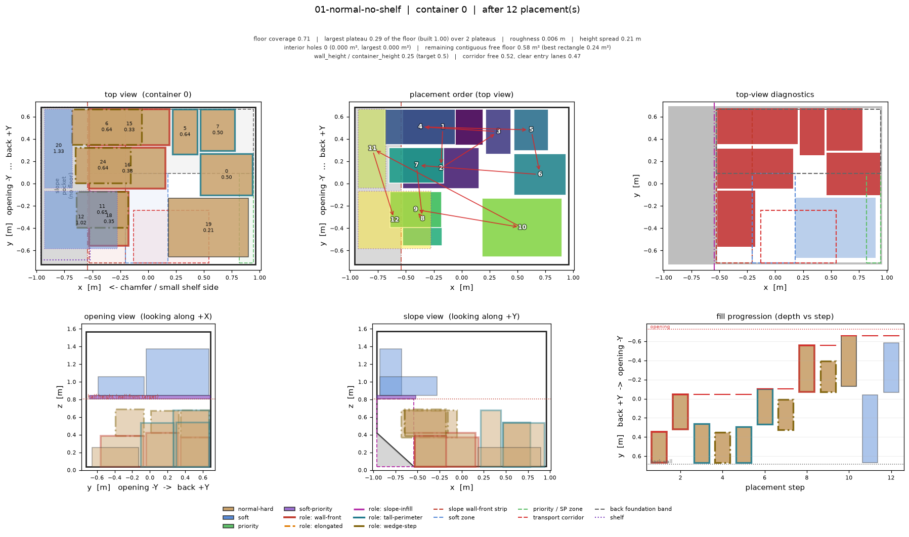

Intermediate steps: [c0_step000](images/01-normal-no-shelf/c0_step000.png), [c0_step003](images/01-normal-no-shelf/c0_step003.png), [c0_step006](images/01-normal-no-shelf/c0_step006.png), [c0_step009](images/01-normal-no-shelf/c0_step009.png), [c0_step012](images/01-normal-no-shelf/c0_step012.png)

### 02-normal-with-shelf

Same cargo mix in a shelf ULD: shows where the soft items go once a shelf exists, and what the shelf does to the back half of the floor.

- stream: 26 items, placed 13, left for Layer 2+ 13
- stop reason: `stream-exhausted`
- roles: `{'wall-front': 2, 'elongated': 1, 'tall-perimeter': 3, 'wedge-step': 1, 'none': 6}`
- winning archetypes: `{'wall-front': 2, 'elongated-wall': 1, 'tall-perimeter': 3, 'wedge-step': 1, 'max-footprint': 1, 'shelf-space-saving': 5}`
- placed by class/surface: `{'normal-hard/floor': 7, 'normal-hard/item': 1, 'soft/shelf': 5}`
- 3D fill: placed `1.01192` m³ of `4.1903` m³ usable = `0.2415`
- official evaluator fill_score: `1.4915`

**container 0** · shelf

- floor coverage `0.622`, largest plateau `0.378` of the usable floor (largest *built* plateau `1.0` of the built surface) over `2` plateaus, height spread `0.375` m, local roughness `0.0066` m
- structural cells masked out of flatness: `0.5516`
- interior holes `0` totalling `0` m², largest `0.0` m²
- remaining contiguous free floor `0.8056` m² (largest inscribed rectangle `0.296` m²)
- slope wall front: `2` items, wall_height / container_height = `0.213`
- transport corridor free `0.7917`, clear entry lanes `0.5`
- 3D fill: placed `1.01192` m³ (floor `0.59409`, shelf `0.41783`, of which structural `0.53615`) of `4.1903` m³ usable = `0.2415`
- foundation slab: normal floor cargo `0.05794` m³ in a 0.375 m slab (`0.80487` m³) = `0.072` — structural and shelf cargo excluded from both sides
- back-to-front: adherence `0.6923` (`4` placements landed behind the frontier, worst backtrack `0.388` m), frontier reached `0.8541` of the depth
- typed support area: `{'hard': 1.3256}`
- zone occupancy: `wall_front_strip` 0.83, `soft_zone` 0.43, `priority_zone` 0.22, `corridor` 0.21, `back_band` 0.83, `centre_band` 0.55

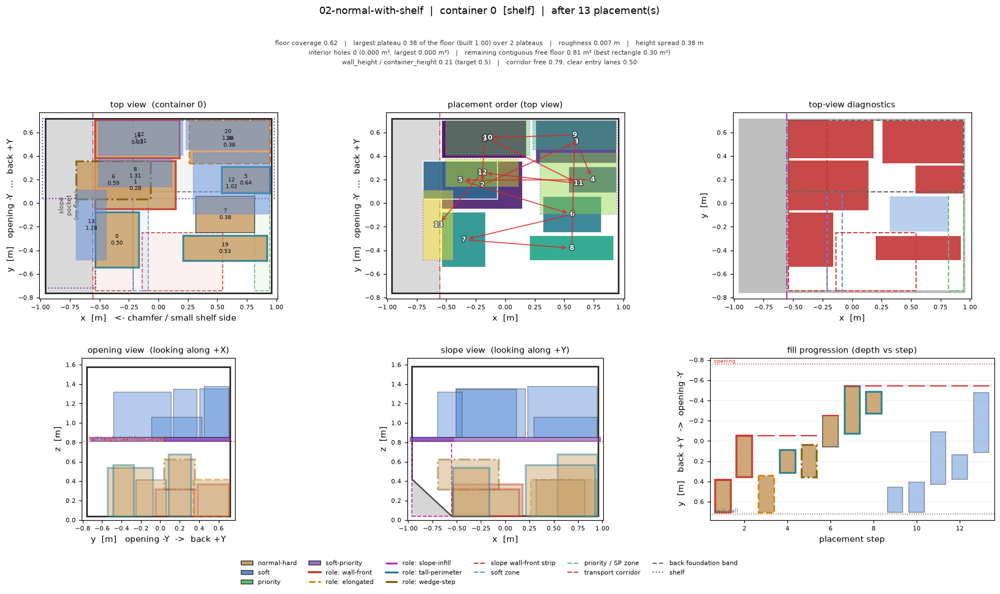

Intermediate steps: [c0_step000](images/02-normal-with-shelf/c0_step000.png), [c0_step003](images/02-normal-with-shelf/c0_step003.png), [c0_step006](images/02-normal-with-shelf/c0_step006.png), [c0_step010](images/02-normal-with-shelf/c0_step010.png), [c0_step013](images/02-normal-with-shelf/c0_step013.png)

### 03-priority-plus-normal

Priority ULD (index 0) next to a normal ULD. Tests the routing rules: soft-only never enters the priority container, plain hard may but only inside its budget.

- stream: 40 items, placed 27, left for Layer 2+ 13
- stop reason: `stream-exhausted`
- roles: `{'tall-perimeter': 11, 'none': 9, 'elongated': 1, 'wall-front': 4, 'wedge-step': 2}`
- winning archetypes: `{'wall-front': 4, 'tall-perimeter': 10, 'wedge-step': 2, 'max-footprint': 6, 'shelf-space-saving': 5}`
- placed by class/surface: `{'normal-hard/floor': 17, 'priority/floor': 3, 'soft-priority/shelf': 3, 'normal-hard/item': 2, 'soft/shelf': 2}`
- 3D fill: placed `2.0754` m³ of `8.19728` m³ usable = `0.2532`
- official evaluator fill_score: `1.4726`

**container 0** · priority · shelf

- floor coverage `0.714`, largest plateau `0.286` of the usable floor (largest *built* plateau `0.5725` of the built surface) over `3` plateaus, height spread `0.521` m, local roughness `0.0136` m
- structural cells masked out of flatness: `0.4927`
- interior holes `0` totalling `0` m², largest `0.0` m²
- remaining contiguous free floor `0.6096` m² (largest inscribed rectangle `0.192` m²)
- slope wall front: `0` items, wall_height / container_height = `0.0`
- transport corridor free `0.1618`, clear entry lanes `0.0294`
- 3D fill: placed `1.09834` m³ (floor `0.87413`, shelf `0.22421`, of which structural `0.69824`) of `4.1903` m³ usable = `0.2621`
- foundation slab: normal floor cargo `0.17588` m³ in a 0.521 m slab (`1.11824` m³) = `0.1573` — structural and shelf cargo excluded from both sides
- back-to-front: adherence `0.4615` (`7` placements landed behind the frontier, worst backtrack `0.94` m), frontier reached `0.9892` of the depth
- typed support area: `{'hard': 1.0284, 'priority-only': 0.4932}`
- zone occupancy: `wall_front_strip` 0.51, `soft_zone` 0.00, `priority_zone` 0.57, `corridor` 0.84, `back_band` 0.70, `centre_band` 0.78

**container 1**

- floor coverage `0.8007`, largest plateau `0.1993` of the usable floor (largest *built* plateau `0.6064` of the built surface) over `3` plateaus, height spread `0.499` m, local roughness `0.0183` m
- structural cells masked out of flatness: `0.6206`
- interior holes `0` totalling `0` m², largest `0.0` m²
- remaining contiguous free floor `0.4016` m² (largest inscribed rectangle `0.08` m²)
- slope wall front: `4` items, wall_height / container_height = `0.2451`
- transport corridor free `0.2212`, clear entry lanes `0.1765`
- 3D fill: placed `0.97706` m³ (floor `0.79427`, shelf `0.18279`, of which structural `0.66488`) of `4.00698` m³ usable = `0.2438`
- foundation slab: normal floor cargo `0.12939` m³ in a 0.499 m slab (`1.01255` m³) = `0.1278` — structural and shelf cargo excluded from both sides
- back-to-front: adherence `0.8571` (`2` placements landed behind the frontier, worst backtrack `0.5` m), frontier reached `0.966` of the depth
- typed support area: `{'hard': 1.6132}`
- zone occupancy: `wall_front_strip` 0.93, `soft_zone` 0.67, `priority_zone` 0.00, `corridor` 0.78, `back_band` 0.83, `centre_band` 0.76

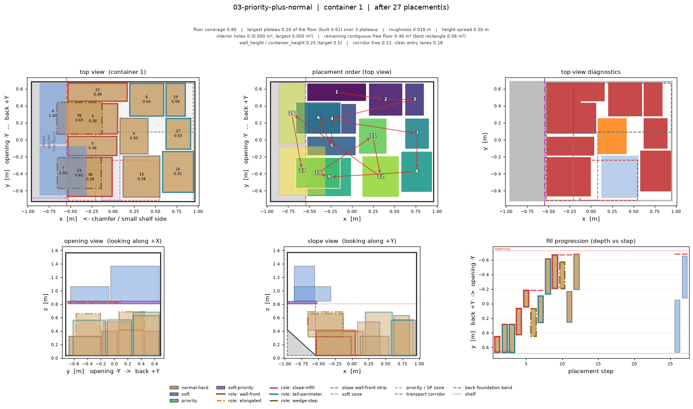

Intermediate steps: [c0_step000](images/03-priority-plus-normal/c0_step000.png), [c1_step000](images/03-priority-plus-normal/c1_step000.png), [c0_step007](images/03-priority-plus-normal/c0_step007.png), [c1_step007](images/03-priority-plus-normal/c1_step007.png), [c0_step014](images/03-priority-plus-normal/c0_step014.png), [c1_step014](images/03-priority-plus-normal/c1_step014.png), [c0_step020](images/03-priority-plus-normal/c0_step020.png), [c1_step020](images/03-priority-plus-normal/c1_step020.png), [c0_step027](images/03-priority-plus-normal/c0_step027.png), [c1_step027](images/03-priority-plus-normal/c1_step027.png)

### 04-soft-heavy

Soft-dominated stream into a shelf ULD: shelf saturates early, the rest must cluster on the left soft strip.

- stream: 26 items, placed 15, left for Layer 2+ 11
- stop reason: `stream-exhausted`
- roles: `{'wall-front': 2, 'wedge-step': 1, 'tall-perimeter': 3, 'none': 9}`
- winning archetypes: `{'wall-front': 2, 'wedge-step': 1, 'tall-perimeter': 3, 'shelf-space-saving': 6, 'soft-edge': 3}`
- placed by class/surface: `{'normal-hard/floor': 5, 'normal-hard/item': 1, 'soft/shelf': 6, 'soft/floor': 3}`
- 3D fill: placed `1.1759` m³ of `4.1903` m³ usable = `0.2806`
- official evaluator fill_score: `13.87`

**container 0** · shelf

- floor coverage `0.6685`, largest plateau `0.3315` of the usable floor (largest *built* plateau `0.4452` of the built surface) over `4` plateaus, height spread `0.465` m, local roughness `0.0129` m
- structural cells masked out of flatness: `0.3587`
- interior holes `0` totalling `0` m², largest `0.0` m²
- remaining contiguous free floor `0.7064` m² (largest inscribed rectangle `0.2576` m²)
- slope wall front: `2` items, wall_height / container_height = `0.2175`
- transport corridor free `0.4081`, clear entry lanes `0.3824`
- 3D fill: placed `1.1759` m³ (floor `0.63744`, shelf `0.53846`, of which structural `0.41151`) of `4.1903` m³ usable = `0.2806`
- foundation slab: normal floor cargo `0.22593` m³ in a 0.465 m slab (`0.99804` m³) = `0.2264` — structural and shelf cargo excluded from both sides
- back-to-front: adherence `0.6` (`6` placements landed behind the frontier, worst backtrack `0.608` m), frontier reached `0.9736` of the depth
- typed support area: `{'hard': 0.7644, 'soft-only': 0.6604}`
- zone occupancy: `wall_front_strip` 0.91, `soft_zone` 0.82, `priority_zone` 0.00, `corridor` 0.59, `back_band` 0.64, `centre_band` 0.56

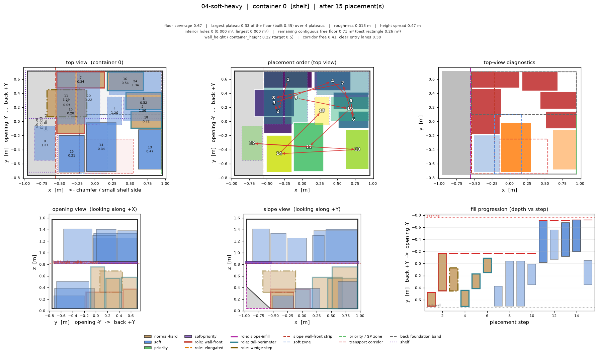

Intermediate steps: [c0_step000](images/04-soft-heavy/c0_step000.png), [c0_step004](images/04-soft-heavy/c0_step004.png), [c0_step008](images/04-soft-heavy/c0_step008.png), [c0_step011](images/04-soft-heavy/c0_step011.png), [c0_step015](images/04-soft-heavy/c0_step015.png)

### 05-priority-heavy-no-priority-uld

Priority-dominated stream with no priority ULD: the priority edge zone on the right is the only home.

- stream: 26 items, placed 9, left for Layer 2+ 17
- stop reason: `stream-exhausted`
- roles: `{'wall-front': 3, 'tall-perimeter': 3, 'none': 2, 'wedge-step': 1}`
- winning archetypes: `{'wall-front': 3, 'tall-perimeter': 2, 'max-footprint': 1, 'priority-edge': 2, 'wedge-step': 1}`
- placed by class/surface: `{'normal-hard/floor': 6, 'priority/floor': 2, 'priority/item': 1}`
- 3D fill: placed `0.68123` m³ of `4.00698` m³ usable = `0.17`
- official evaluator fill_score: `0.0`

**container 0**

- floor coverage `0.7632`, largest plateau `0.2368` of the usable floor (largest *built* plateau `0.7481` of the built surface) over `3` plateaus, height spread `0.493` m, local roughness `0.0133` m
- structural cells masked out of flatness: `0.5267`
- interior holes `0` totalling `0` m², largest `0.0` m²
- remaining contiguous free floor `0.4772` m² (largest inscribed rectangle `0.0816` m²)
- slope wall front: `3` items, wall_height / container_height = `0.2464`
- transport corridor free `0.1637`, clear entry lanes `0.1176`
- 3D fill: placed `0.68123` m³ (floor `0.68123`, shelf `0.0`, of which structural `0.51973`) of `4.00698` m³ usable = `0.17`
- foundation slab: normal floor cargo `0.1615` m³ in a 0.493 m slab (`1.00037` m³) = `0.1614` — structural and shelf cargo excluded from both sides
- back-to-front: adherence `0.5556` (`4` placements landed behind the frontier, worst backtrack `0.93` m), frontier reached `0.9887` of the depth
- typed support area: `{'hard': 0.7988, 'priority-only': 0.7388}`
- zone occupancy: `wall_front_strip` 0.87, `soft_zone` 0.00, `priority_zone` 0.62, `corridor` 0.84, `back_band` 0.84, `centre_band` 0.80

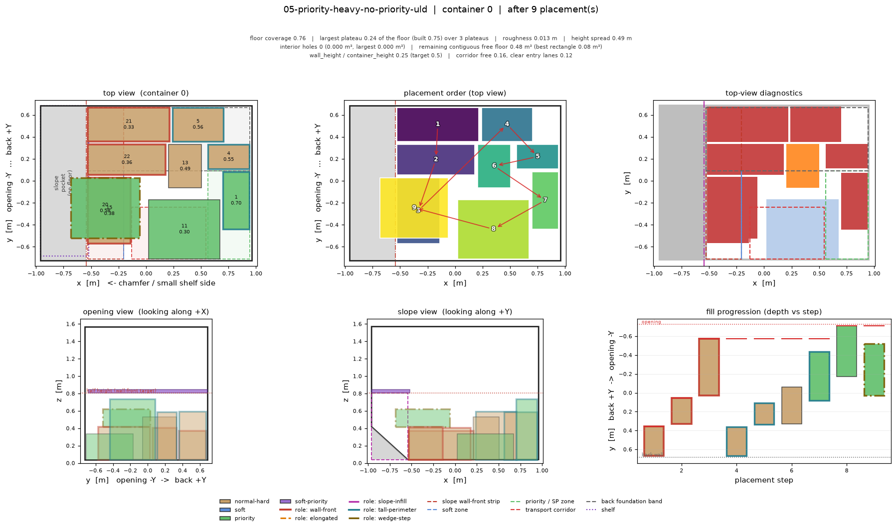

Intermediate steps: [c0_step000](images/05-priority-heavy-no-priority-uld/c0_step000.png), [c0_step002](images/05-priority-heavy-no-priority-uld/c0_step002.png), [c0_step004](images/05-priority-heavy-no-priority-uld/c0_step004.png), [c0_step007](images/05-priority-heavy-no-priority-uld/c0_step007.png), [c0_step009](images/05-priority-heavy-no-priority-uld/c0_step009.png)

### 06-soft-priority-heavy

Soft+priority dominated stream with a priority shelf ULD present: SP should prefer the priority shelf, then cluster.

- stream: 34 items, placed 24, left for Layer 2+ 10
- stop reason: `stream-exhausted`
- roles: `{'none': 16, 'wall-front': 2, 'wedge-step': 2, 'tall-perimeter': 3, 'elongated': 1}`
- winning archetypes: `{'wall-front': 2, 'wedge-step': 2, 'tall-perimeter': 3, 'elongated-wall': 1, 'shelf-space-saving': 10, 'sp-cluster': 6}`
- placed by class/surface: `{'soft-priority/shelf': 10, 'soft-priority/floor': 6, 'normal-hard/floor': 6, 'normal-hard/item': 2}`
- 3D fill: placed `2.04887` m³ of `8.19728` m³ usable = `0.2499`
- official evaluator fill_score: `9.7846`

**container 0** · priority · shelf

- floor coverage `0.586`, largest plateau `0.414` of the usable floor (largest *built* plateau `0.2594` of the built surface) over `6` plateaus, height spread `0.44` m, local roughness `0.0156` m
- structural cells masked out of flatness: `0.0`
- interior holes `0` totalling `0` m², largest `0.0` m²
- remaining contiguous free floor `0.8824` m² (largest inscribed rectangle `0.2592` m²)
- slope wall front: `0` items, wall_height / container_height = `0.0`
- transport corridor free `0.4216`, clear entry lanes `0.0588`
- 3D fill: placed `1.13592` m³ (floor `0.43335`, shelf `0.70256`, of which structural `0.0`) of `4.1903` m³ usable = `0.2711`
- foundation slab: normal floor cargo `0.43335` m³ in a 0.44 m slab (`0.94439` m³) = `0.4589` — structural and shelf cargo excluded from both sides
- back-to-front: adherence `0.75` (`3` placements landed behind the frontier, worst backtrack `0.632` m), frontier reached `0.9757` of the depth
- typed support area: `{'soft+priority-only': 1.2488}`
- zone occupancy: `wall_front_strip` 0.58, `soft_zone` 0.00, `priority_zone` 0.40, `corridor` 0.58, `back_band` 0.52, `centre_band` 0.65

**container 1**

- floor coverage `0.6405`, largest plateau `0.3595` of the usable floor (largest *built* plateau `1.0` of the built surface) over `2` plateaus, height spread `0.361` m, local roughness `0.0084` m
- structural cells masked out of flatness: `0.5229`
- interior holes `0` totalling `0` m², largest `0.0` m²
- remaining contiguous free floor `0.7244` m² (largest inscribed rectangle `0.216` m²)
- slope wall front: `2` items, wall_height / container_height = `0.2216`
- transport corridor free `0.5345`, clear entry lanes `0.1765`
- 3D fill: placed `0.91295` m³ (floor `0.72849`, shelf `0.18447`, of which structural `0.6419`) of `4.00698` m³ usable = `0.2278`
- foundation slab: normal floor cargo `0.08658` m³ in a 0.361 m slab (`0.73252` m³) = `0.1182` — structural and shelf cargo excluded from both sides
- back-to-front: adherence `0.6667` (`4` placements landed behind the frontier, worst backtrack `0.208` m), frontier reached `0.8965` of the depth
- typed support area: `{'hard': 1.0536, 'soft+priority-only': 0.2368}`
- zone occupancy: `wall_front_strip` 0.67, `soft_zone` 0.63, `priority_zone` 0.00, `corridor` 0.47, `back_band` 0.76, `centre_band` 0.58

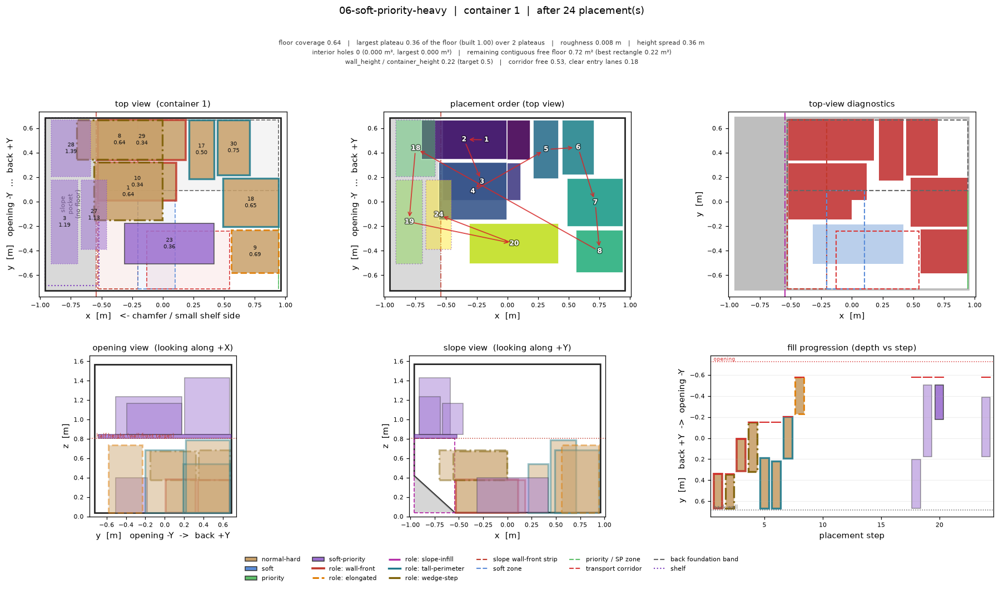

Intermediate steps: [c0_step000](images/06-soft-priority-heavy/c0_step000.png), [c1_step000](images/06-soft-priority-heavy/c1_step000.png), [c0_step006](images/06-soft-priority-heavy/c0_step006.png), [c1_step006](images/06-soft-priority-heavy/c1_step006.png), [c0_step012](images/06-soft-priority-heavy/c0_step012.png), [c1_step012](images/06-soft-priority-heavy/c1_step012.png), [c0_step018](images/06-soft-priority-heavy/c0_step018.png), [c1_step018](images/06-soft-priority-heavy/c1_step018.png), [c0_step024](images/06-soft-priority-heavy/c0_step024.png), [c1_step024](images/06-soft-priority-heavy/c1_step024.png)

### 07-elongated-heavy

Long thin cargo (rho 2.5-6): the structural exception path. Watch where the wall / corner preference sends them and which poses the tipping bands refuse.

- stream: 22 items, placed 16, left for Layer 2+ 6
- stop reason: `stream-exhausted`
- roles: `{'elongated': 12, 'wall-front': 1, 'wedge-step': 2, 'none': 1}`
- winning archetypes: `{'elongated-wall': 12, 'wall-front': 1, 'wedge-step': 2, 'shelf-space-saving': 1}`
- placed by class/surface: `{'normal-hard/floor': 13, 'normal-hard/item': 2, 'soft/shelf': 1}`
- 3D fill: placed `1.08325` m³ of `4.00698` m³ usable = `0.2703`
- official evaluator fill_score: `2.0553`

**container 0**

- floor coverage `0.5976`, largest plateau `0.4024` of the usable floor (largest *built* plateau `0.0` of the built surface) over `1` plateaus, height spread `0.0` m, local roughness `0.0` m
- structural cells masked out of flatness: `0.5976`
- interior holes `0` totalling `0` m², largest `0.0` m²
- remaining contiguous free floor `0.8108` m² (largest inscribed rectangle `0.264` m²)
- slope wall front: `1` items, wall_height / container_height = `0.1765`
- transport corridor free `0.7749`, clear entry lanes `0.5294`
- 3D fill: placed `1.08325` m³ (floor `1.05119`, shelf `0.03207`, of which structural `1.05119`) of `4.00698` m³ usable = `0.2703`
- foundation slab: normal floor cargo `0.0` m³ in a 0.0 m slab (`0.0` m³) = `None` — structural and shelf cargo excluded from both sides
- back-to-front: adherence `0.3125` (`11` placements landed behind the frontier, worst backtrack `0.9` m), frontier reached `0.9532` of the depth
- typed support area: `{'hard': 1.204}`
- zone occupancy: `wall_front_strip` 0.68, `soft_zone` 0.42, `priority_zone` 0.00, `corridor` 0.23, `back_band` 0.74, `centre_band` 0.58

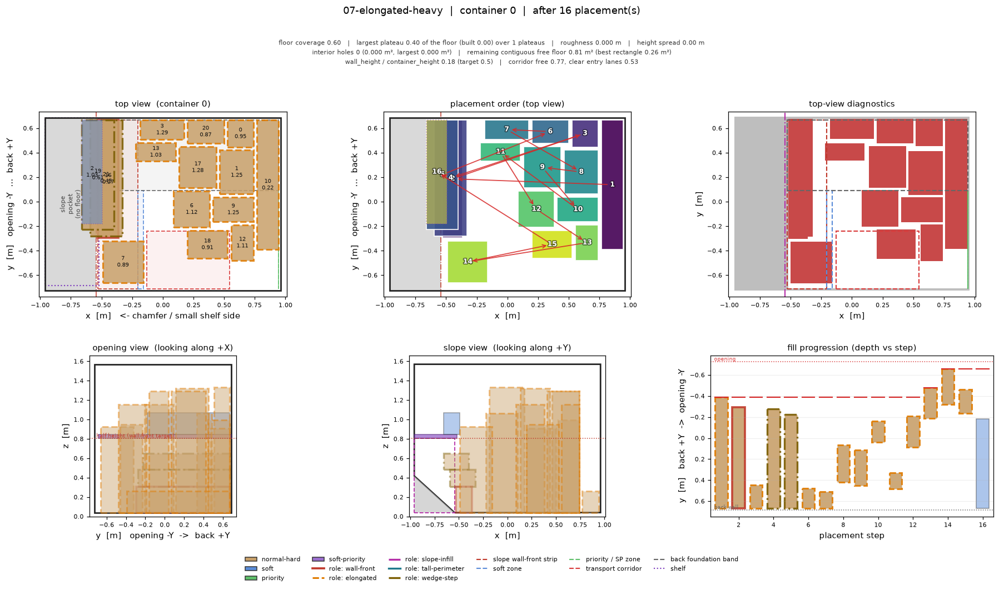

Intermediate steps: [c0_step000](images/07-elongated-heavy/c0_step000.png), [c0_step004](images/07-elongated-heavy/c0_step004.png), [c0_step008](images/07-elongated-heavy/c0_step008.png), [c0_step012](images/07-elongated-heavy/c0_step012.png), [c0_step016](images/07-elongated-heavy/c0_step016.png)

### 08-slope-exploitation

Small low boxes that would fit the chamfer wedge if it were reachable. This scenario exists to show whether the slope pocket is usable at all from a floor layer.

- stream: 30 items, placed 15, left for Layer 2+ 15
- stop reason: `stream-exhausted`
- roles: `{'wall-front': 2, 'tall-perimeter': 6, 'wedge-step': 4, 'none': 3}`
- winning archetypes: `{'wall-front': 2, 'tall-perimeter': 6, 'wedge-step': 4, 'max-footprint': 3}`
- placed by class/surface: `{'normal-hard/floor': 11, 'normal-hard/item': 4}`
- 3D fill: placed `0.56302` m³ of `4.00698` m³ usable = `0.1405`
- official evaluator fill_score: `2.2277`

**container 0**

- floor coverage `0.642`, largest plateau `0.358` of the usable floor (largest *built* plateau `0.3975` of the built surface) over `4` plateaus, height spread `0.284` m, local roughness `0.0094` m
- structural cells masked out of flatness: `0.4173`
- interior holes `0` totalling `0` m², largest `0.0` m²
- remaining contiguous free floor `0.7212` m² (largest inscribed rectangle `0.2632` m²)
- slope wall front: `2` items, wall_height / container_height = `0.215`
- transport corridor free `0.7468`, clear entry lanes `0.3529`
- 3D fill: placed `0.56302` m³ (floor `0.56302`, shelf `0.0`, of which structural `0.44222`) of `4.00698` m³ usable = `0.1405`
- foundation slab: normal floor cargo `0.12081` m³ in a 0.284 m slab (`0.57628` m³) = `0.2096` — structural and shelf cargo excluded from both sides
- back-to-front: adherence `0.6` (`6` placements landed behind the frontier, worst backtrack `0.439` m), frontier reached `0.9872` of the depth
- typed support area: `{'hard': 1.2936}`
- zone occupancy: `wall_front_strip` 0.84, `soft_zone` 0.00, `priority_zone` 0.00, `corridor` 0.25, `back_band` 0.80, `centre_band` 0.59

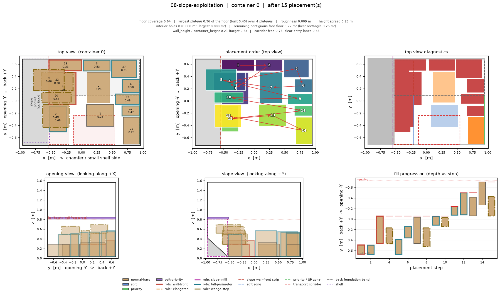

Intermediate steps: [c0_step000](images/08-slope-exploitation/c0_step000.png), [c0_step004](images/08-slope-exploitation/c0_step004.png), [c0_step008](images/08-slope-exploitation/c0_step008.png), [c0_step011](images/08-slope-exploitation/c0_step011.png), [c0_step015](images/08-slope-exploitation/c0_step015.png)

### 09-mixed-random

Realistic mixed stream matching the official sample config class ratios.

- stream: 34 items, placed 16, left for Layer 2+ 18
- stop reason: `stream-exhausted`
- roles: `{'wall-front': 2, 'tall-perimeter': 5, 'wedge-step': 1, 'none': 8}`
- winning archetypes: `{'wall-front': 2, 'tall-perimeter': 3, 'wedge-step': 1, 'max-footprint': 1, 'priority-edge': 3, 'shelf-space-saving': 6}`
- placed by class/surface: `{'normal-hard/floor': 6, 'normal-hard/item': 1, 'priority/floor': 3, 'soft-priority/shelf': 2, 'soft/shelf': 4}`
- 3D fill: placed `1.24617` m³ of `4.1903` m³ usable = `0.2974`
- official evaluator fill_score: `1.0086`

**container 0** · shelf

- floor coverage `0.7074`, largest plateau `0.2926` of the usable floor (largest *built* plateau `0.5689` of the built surface) over `3` plateaus, height spread `0.211` m, local roughness `0.0079` m
- structural cells masked out of flatness: `0.5193`
- interior holes `0` totalling `0` m², largest `0.0` m²
- remaining contiguous free floor `0.6236` m² (largest inscribed rectangle `0.152` m²)
- slope wall front: `2` items, wall_height / container_height = `0.2468`
- transport corridor free `0.2917`, clear entry lanes `0.0588`
- 3D fill: placed `1.24617` m³ (floor `0.67735`, shelf `0.56882`, of which structural `0.59422`) of `4.1903` m³ usable = `0.2974`
- foundation slab: normal floor cargo `0.08312` m³ in a 0.211 m slab (`0.45288` m³) = `0.1835` — structural and shelf cargo excluded from both sides
- back-to-front: adherence `0.625` (`6` placements landed behind the frontier, worst backtrack `0.478` m), frontier reached `0.9649` of the depth
- typed support area: `{'hard': 1.032, 'priority-only': 0.4756}`
- zone occupancy: `wall_front_strip` 0.74, `soft_zone` 0.54, `priority_zone` 0.81, `corridor` 0.71, `back_band` 0.82, `centre_band` 0.67

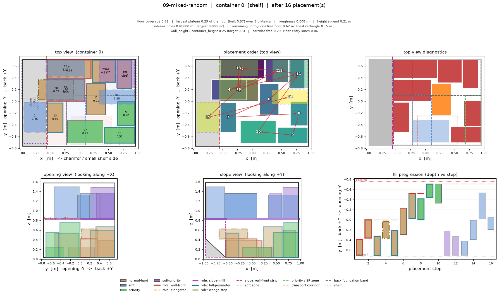

Intermediate steps: [c0_step000](images/09-mixed-random/c0_step000.png), [c0_step004](images/09-mixed-random/c0_step004.png), [c0_step008](images/09-mixed-random/c0_step008.png), [c0_step012](images/09-mixed-random/c0_step012.png), [c0_step016](images/09-mixed-random/c0_step016.png)

### 10-awkward-holes

Deliberately badly tiling sizes: the hole diagnostics scenario. Interior holes here are the point, not a bug.

- stream: 26 items, placed 12, left for Layer 2+ 14
- stop reason: `stream-exhausted`
- roles: `{'wall-front': 3, 'wedge-step': 1, 'elongated': 2, 'tall-perimeter': 3, 'none': 3}`
- winning archetypes: `{'wall-front': 3, 'wedge-step': 1, 'elongated-wall': 2, 'tall-perimeter': 3, 'max-footprint': 1, 'shelf-space-saving': 2}`
- placed by class/surface: `{'normal-hard/floor': 9, 'normal-hard/item': 1, 'soft/shelf': 2}`
- 3D fill: placed `0.84231` m³ of `4.00698` m³ usable = `0.2102`
- official evaluator fill_score: `1.2279`

**container 0**

- floor coverage `0.7495`, largest plateau `0.2505` of the usable floor (largest *built* plateau `1.0` of the built surface) over `2` plateaus, height spread `0.33` m, local roughness `0.0048` m
- structural cells masked out of flatness: `0.6325`
- interior holes `0` totalling `0` m², largest `0.0` m²
- remaining contiguous free floor `0.5048` m² (largest inscribed rectangle `0.1976` m²)
- slope wall front: `3` items, wall_height / container_height = `0.2418`
- transport corridor free `0.4054`, clear entry lanes `0.0882`
- 3D fill: placed `0.84231` m³ (floor `0.71678`, shelf `0.12553`, of which structural `0.63698`) of `4.00698` m³ usable = `0.2102`
- foundation slab: normal floor cargo `0.07979` m³ in a 0.33 m slab (`0.66962` m³) = `0.1192` — structural and shelf cargo excluded from both sides
- back-to-front: adherence `0.5833` (`5` placements landed behind the frontier, worst backtrack `0.492` m), frontier reached `0.9844` of the depth
- typed support area: `{'hard': 1.51}`
- zone occupancy: `wall_front_strip` 0.88, `soft_zone` 0.59, `priority_zone` 0.00, `corridor` 0.59, `back_band` 0.85, `centre_band` 0.70

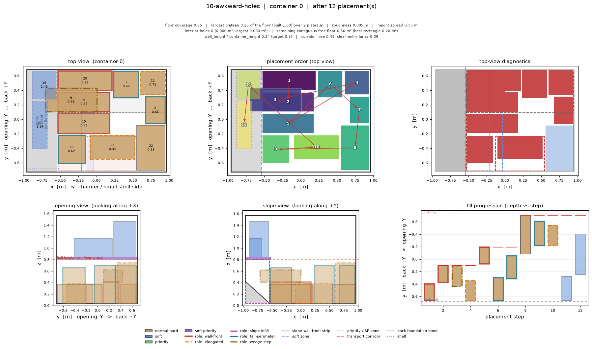

Intermediate steps: [c0_step000](images/10-awkward-holes/c0_step000.png), [c0_step003](images/10-awkward-holes/c0_step003.png), [c0_step006](images/10-awkward-holes/c0_step006.png), [c0_step009](images/10-awkward-holes/c0_step009.png), [c0_step012](images/10-awkward-holes/c0_step012.png)

### 11-lookahead-3

Same mix as 09 but with look_ahead=3, to see whether the pool ordering rule changes the board shape.

- stream: 34 items, placed 16, left for Layer 2+ 18
- stop reason: `stream-exhausted`
- roles: `{'wall-front': 2, 'wedge-step': 2, 'tall-perimeter': 4, 'none': 8}`
- winning archetypes: `{'wall-front': 2, 'wedge-step': 2, 'tall-perimeter': 3, 'max-footprint': 2, 'priority-edge': 1, 'shelf-space-saving': 6}`
- placed by class/surface: `{'normal-hard/floor': 7, 'normal-hard/item': 2, 'priority/floor': 1, 'soft-priority/shelf': 2, 'soft/shelf': 4}`
- 3D fill: placed `1.2754` m³ of `4.1903` m³ usable = `0.3044`
- official evaluator fill_score: `1.6037`

**container 0** · shelf

- floor coverage `0.6867`, largest plateau `0.3133` of the usable floor (largest *built* plateau `0.5383` of the built surface) over `3` plateaus, height spread `0.531` m, local roughness `0.0146` m
- structural cells masked out of flatness: `0.4733`
- interior holes `0` totalling `0` m², largest `0.0` m²
- remaining contiguous free floor `0.6676` m² (largest inscribed rectangle `0.2592` m²)
- slope wall front: `2` items, wall_height / container_height = `0.2468`
- transport corridor free `0.462`, clear entry lanes `0.2353`
- 3D fill: placed `1.2754` m³ (floor `0.74306`, shelf `0.53234`, of which structural `0.5609`) of `4.1903` m³ usable = `0.3044`
- foundation slab: normal floor cargo `0.18215` m³ in a 0.531 m slab (`1.1397` m³) = `0.1598` — structural and shelf cargo excluded from both sides
- back-to-front: adherence `0.6875` (`5` placements landed behind the frontier, worst backtrack `0.316` m), frontier reached `0.9649` of the depth
- typed support area: `{'hard': 1.346, 'priority-only': 0.1176}`
- zone occupancy: `wall_front_strip` 0.94, `soft_zone` 0.47, `priority_zone` 0.12, `corridor` 0.54, `back_band` 0.79, `centre_band` 0.80

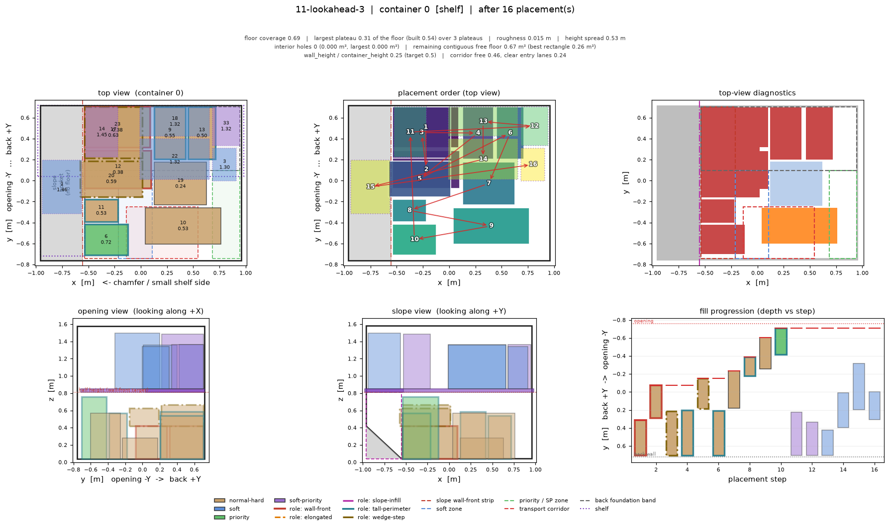

Intermediate steps: [c0_step000](images/11-lookahead-3/c0_step000.png), [c0_step004](images/11-lookahead-3/c0_step004.png), [c0_step008](images/11-lookahead-3/c0_step008.png), [c0_step012](images/11-lookahead-3/c0_step012.png), [c0_step016](images/11-lookahead-3/c0_step016.png)

### 12-large-hard-only

Only large plain hard cargo: the best case for the rectangular floor rule, and the flatness reference.

- stream: 20 items, placed 4, left for Layer 2+ 16
- stop reason: `stream-exhausted`
- roles: `{'none': 3, 'tall-perimeter': 1}`
- winning archetypes: `{'max-footprint': 3, 'tall-perimeter': 1}`
- placed by class/surface: `{'normal-hard/floor': 4}`
- 3D fill: placed `0.43769` m³ of `4.00698` m³ usable = `0.1092`
- official evaluator fill_score: `0.0`

**container 0**

- floor coverage `0.6869`, largest plateau `0.3131` of the usable floor (largest *built* plateau `0.3375` of the built surface) over `4` plateaus, height spread `0.32` m, local roughness `0.0091` m
- structural cells masked out of flatness: `0.0774`
- interior holes `0` totalling `0` m², largest `0.0` m²
- remaining contiguous free floor `0.6308` m² (largest inscribed rectangle `0.2736` m²)
- slope wall front: `0` items, wall_height / container_height = `0.0`
- transport corridor free `0.7609`, clear entry lanes `0.5`
- 3D fill: placed `0.43769` m³ (floor `0.43769`, shelf `0.0`, of which structural `0.10723`) of `4.00698` m³ usable = `0.1092`
- foundation slab: normal floor cargo `0.33047` m³ in a 0.32 m slab (`0.64933` m³) = `0.5089` — structural and shelf cargo excluded from both sides
- back-to-front: adherence `1.0` (`0` placements landed behind the frontier, worst backtrack `0.0` m), frontier reached `0.9277` of the depth
- typed support area: `{'hard': 1.384}`
- zone occupancy: `wall_front_strip` 0.63, `soft_zone` 0.00, `priority_zone` 0.00, `corridor` 0.24, `back_band` 0.86, `centre_band` 0.70

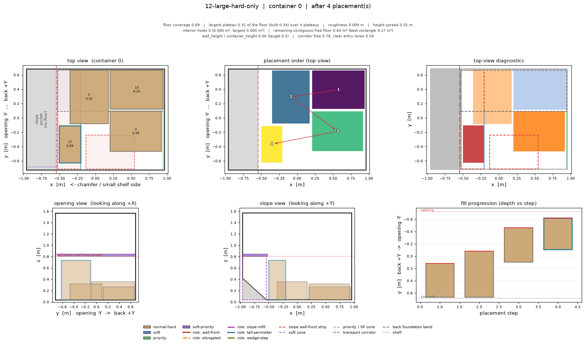

Intermediate steps: [c0_step000](images/12-large-hard-only/c0_step000.png), [c0_step001](images/12-large-hard-only/c0_step001.png), [c0_step002](images/12-large-hard-only/c0_step002.png), [c0_step003](images/12-large-hard-only/c0_step003.png), [c0_step004](images/12-large-hard-only/c0_step004.png)

## Config used

```json
{
  "inclusion_clearance": 0.016,
  "floor_action_lift": 0.02,
  "settled_wall_clearance": 0.006,
  "transport_clearance": 0.016,
  "settled_clearance": 0.026,
  "contact_tolerance": 0.006,
  "min_support_ratio": 0.6,
  "elongation_tau": 1.8,
  "tipping_normal": 1.5,
  "tipping_wall_preferred": 2.0,
  "tipping_wall_strong": 3.0,
  "max_freestanding_ratio": 2.0,
  "min_floor_footprint_fraction": 0.6,
  "max_shelf_tipping_ratio": 2.2,
  "back_band_fraction": 0.42,
  "edge_band_fraction": 0.26,
  "corridor_width_fraction": 0.46,
  "corridor_depth_fraction": 0.34,
  "corridor_release_fill": 0.62,
  "wall_front_band": 0.1,
  "wall_front_target_ratio": 0.5,
  "wall_front_min_height": 0.25,
  "wall_front_max_height_shelf_fraction": 0.5,
  "tall_perimeter_max_footprint_fraction": 0.18,
  "tall_perimeter_min_height": 0.3,
  "wall_front_strip_fraction": 0.22,
  "wall_front_max_footprint_fraction": 0.13,
  "wall_front_depth_target": 0.85,
  "wedge_overhang_fraction": 0.25,
  "wedge_step_max_footprint_fraction": 0.1,
  "wedge_step_max_height": 0.35,
  "wedge_min_step_gain": 0.03,
  "wedge_step_probe_width": 0.4,
  "wedge_step_probe_height": 0.2,
  "wedge_cap_ladder_depth": 1,
  "wedge_weight_step": 1.0,
  "wedge_weight_cap": 0.6,
  "wedge_weight_area": 0.6,
  "wedge_weight_fill": 0.9,
  "wedge_weight_bottleneck": 0.6,
  "wedge_min_step_share": 0.1,
  "wedge_reserve_threshold": 0.25,
  "slope_pocket_margin": 0.004,
  "slope_pocket_min_penetration": 0.06,
  "slope_pocket_min_share": 0.5,
  "grid_cell": 0.02,
  "candidate_grid_cell": 0.04,
  "max_new_interior_hole": 0.06,
  "plateau_height_tolerance": 0.03,
  "priority_container_hard_budget": 0.45,
  "max_candidates_per_orientation": 220,
  "max_anchor_x": 26,
  "max_anchor_y": 22,
  "shortlist_size": 60,
  "residual_rect_shortlist": 24,
  "zone_guard_fraction": 0.15,
  "frontier_item_contact_weight": 2.0,
  "zone_reference_share": 0.25,
  "layer1_only": true,
  "allow_slope_infill_on_items": true
}
```
