# rule-alpha — what terrain does Layer 1 leave behind?

Generated by `scripts/rule_alpha_terrain.py`.  Read-only survey of the
shipped Layer 1: no rule was changed to produce it.

The zoning this survey is measured against (the target, not the
current behaviour):

| zone | intent |
|---|---|
| centre | normal-hard terraces; higher at the back, lower at the front, grown by Layer 2 |
| shelf | first home for soft / priority / SP — spend the headroom before going to the floor |
| left/right back | big or tall hard cargo; the outer anchor that keeps big items out of the centre |
| left/right front | low, fairly large hard; a landing pad for soft / priority overflow, ordinary support if none arrives |
| front centre | accessibility first — blocking it must cost more than blocking the front corners |
| chamfer | the progressive wedge staircase, as a local support-growth mechanism |

The reporting partition is 4 x 2 over the usable floor — `chamfer` /
`left` / `centre` / `right` in x, `back` / `front` split at the middle
of the depth — plus the shelf.  It is deliberately *not* the zone set
the rules steer by, so the tables can show where the two disagree.

## Headline

| scenario | placed | NH y-centroid | NH back share | NH centre share | buildable | soft-capped m² | shelf fill | overflow | reach@floor | reach-back@0.4 |
|---|---|---|---|---|---|---|---|---|---|
| 01-normal-no-shelf | 16/26 | 0.748 | 1.000 | 0.530 | 0.664 | 0.4120 | 0.161 | 2 | 0.228 | 0.016 |
| 02-normal-with-shelf | 16/26 | 0.734 | 1.000 | 0.000 | 0.672 | 0.4692 | 0.334 | 2 | 0.239 | 0.194 |
| 03-priority-plus-normal | 29/40 | 0.679 | 0.791 | 0.000 | 0.668 | 0.5324 | 0.157 | 3 | 0.117 | 0.212 |
| 04-soft-heavy | 14/26 | 0.618 | 0.670 | 0.609 | 0.457 | 0.4096 | 0.387 | 2 | 0.239 | 0.552 |
| 05-priority-heavy-no-priority-uld | 13/26 | 0.785 | 1.000 | 0.167 | 0.317 | 0.7752 | 0.000 | 3 | 0.133 | 0.077 |
| 06-soft-priority-heavy | 23/34 | — | — | — | 0.314 | 1.4620 | 0.457 | 5 | 0.221 | 1.000 |
| 07-elongated-heavy | 19/22 | 0.616 | 0.822 | 0.425 | 0.199 | 0.0000 | 0.000 | 0 | 0.214 | 0.046 |
| 08-slope-exploitation | 29/30 | 0.684 | 0.914 | 0.442 | 0.743 | 0.0000 | 0.000 | 0 | 0.396 | 0.087 |
| 09-mixed-random | 17/34 | 0.800 | 1.000 | 0.000 | 0.339 | 0.6932 | 0.401 | 4 | 0.180 | 0.167 |
| 10-awkward-holes | 19/26 | 0.558 | 0.635 | 0.270 | 0.512 | 0.0000 | 0.287 | 0 | 0.141 | 0.000 |
| 11-lookahead-3 | 13/34 | 0.727 | 0.822 | 0.000 | 0.375 | 0.2476 | 0.145 | 2 | 0.271 | 0.050 |
| 12-large-hard-only | 17/20 | 0.519 | 0.475 | 0.220 | 0.568 | 0.0000 | 0.000 | 0 | 0.082 | 0.027 |
| 13-small-first-then-large | 18/20 | 0.560 | 0.711 | 0.421 | 0.608 | 0.0000 | 0.000 | 0 | 0.235 | 0.086 |

## 01-normal-no-shelf

Single ULD without a shelf, mostly plain hard cargo. The reference picture for the rectangular floor rule.

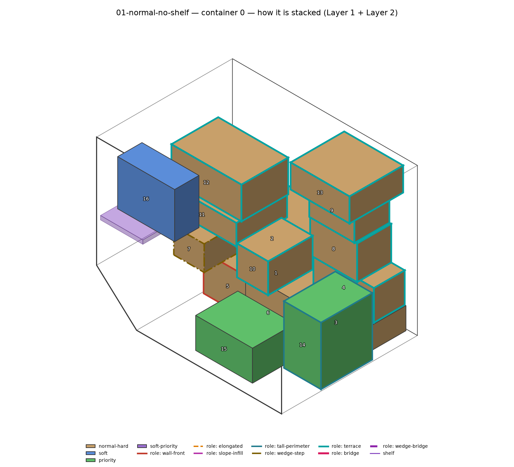
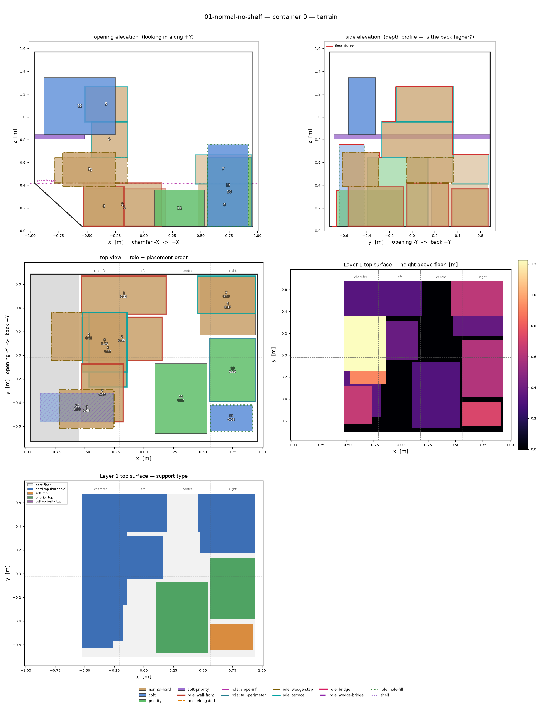

### container 0  (shelf=False, priority=False, placed=16)

| cell | coverage | mean h | max h | hard top m² | soft top m² | items | first step |
|---|---|---|---|---|---|---|---|
| `chamfer-back` | 0.966 | 0.939 | 1.346 | 0.2164 | 0.0000 | 4 | 5 |
| `left-back` | 0.950 | 0.851 | 1.346 | 0.2528 | 0.0000 | 3 | 1 |
| `centre-back` | 0.910 | 1.184 | 1.472 | 0.2420 | 0.0000 | 6 | 3 |
| `right-back` | 0.865 | 0.980 | 1.472 | 0.1624 | 0.0000 | 0 | — |
| `chamfer-front` | 0.353 | 0.456 | 1.346 | 0.0768 | 0.0000 | 0 | — |
| `left-front` | 0.669 | 0.479 | 1.346 | 0.0848 | 0.0000 | 0 | — |
| `centre-front` | 0.754 | 0.302 | 0.802 | 0.0448 | 0.0000 | 1 | 15 |
| `right-front` | 0.412 | 0.247 | 0.601 | 0.0000 | 0.0000 | 1 | 14 |

**normal-hard floor layer** — 4 items, 0.8208 m²; centroid (x=0.440, y=0.748) in normalised floor coordinates; back share 1.000, centre share 0.530; mean top height by depth third (front→back) [None, 0.437, 0.277].

**surface** — buildable 0.664 (1.3380 m², 4 pads), soft-capped 0.4120 m². Support area {'free-floor': 0.5228, 'hard': 1.08, 'soft-only': 0.0, 'priority-only': 0.412, 'soft+priority-only': 0.0}.  Height bands {'0.00-0.15': 0.5228, '0.15-0.30': 0.0104, '0.30-0.50': 0.2808, '0.50-0.80': 0.4464, '0.80+': 0.7544}.

**shelf** — {'has_shelf': True, 'headroom_m': 0.725, 'headroom_volume_m3': 0.437, 'shelf_area_m2': 0.6028, 'shelf_volume_used_m3': 0.0702, 'shelf_fill_ratio': 0.161, 'shelf_items': 1, 'shelf_footprint_ratio': 0.248, 'max_used_height_m': 0.469, 'headroom_height_used_ratio': 0.647, 'back_share_of_shelf_area': 0.0, 'overflow_items': 2, 'overflow_volume_m3': 0.2047}

**access** — {'corridor': {'area_m2': 0.3128, 'free_ratio': 0.304, 'mean_height_m': 0.226, 'max_height_m': 1.015}, 'front_centre': {'area_m2': 0.2584, 'free_ratio': 0.246, 'mean_height_m': 0.302, 'max_height_m': 0.802}, 'approach': {'width_m': 1.46, 'median_clearance_m': 0.728, 'max_clearance_m': 1.53, 'width_over_0.30m': 0.9, 'width_over_0.50m': 0.9, 'width_over_0.70m': 0.9}, 'reach': {'0.00': {'reachable_ratio': 0.228, 'reachable_free_m2': 0.4308, 'reachable_back_ratio': 0.003}, '0.20': {'reachable_ratio': 0.228, 'reachable_free_m2': 0.4308, 'reachable_back_ratio': 0.003}, '0.40': {'reachable_ratio': 0.359, 'reachable_free_m2': 0.456, 'reachable_back_ratio': 0.016}, '0.60': {'reachable_ratio': 0.377, 'reachable_free_m2': 0.456, 'reachable_back_ratio': 0.038}}, 'clear_lane_width_m': 0.02, 'front_half_max_height_m': 1.346, 'back_half_mean_height_m': 0.991}

**tall structure** — 1 tall-perimeter items, back share 0.000, median step back — vs front 14.000.

| step | role | cell | height m | footprint m² | class |
|---|---|---|---|---|---|
| 1 | wall-front | `left-back` | 0.328 | 0.2315 | normal-hard |
| 5 | wall-front | `chamfer-back` | 0.375 | 0.1545 | normal-hard |
| 14 | tall-perimeter | `right-front` | 0.601 | 0.2052 | priority |

## 02-normal-with-shelf

Same cargo mix in a shelf ULD: shows where the soft items go once a shelf exists, and what the shelf does to the back half of the floor.

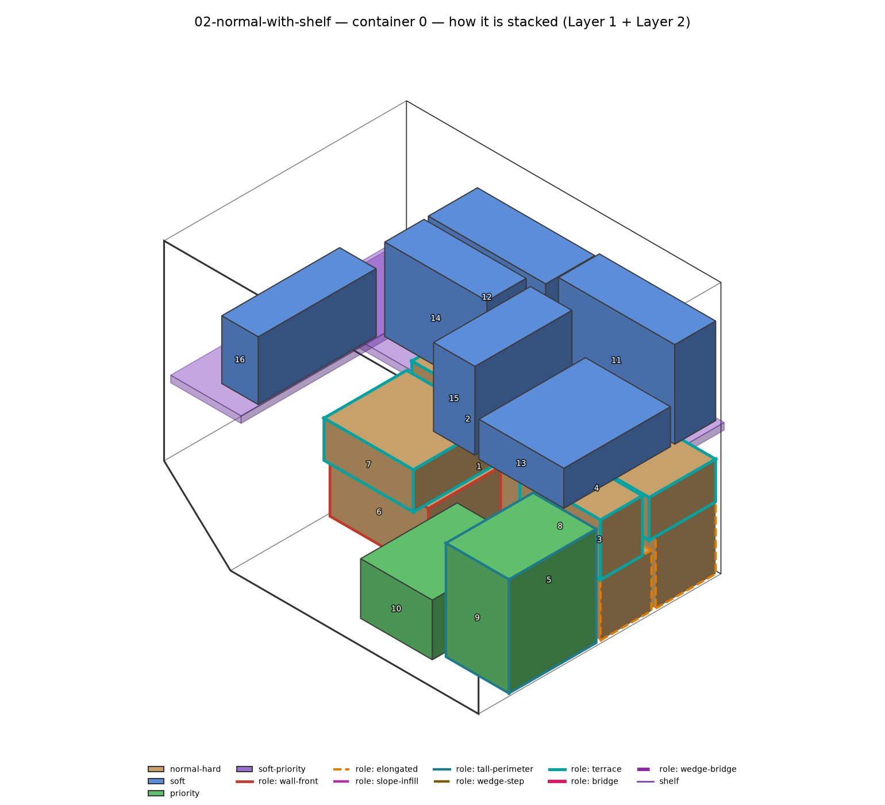
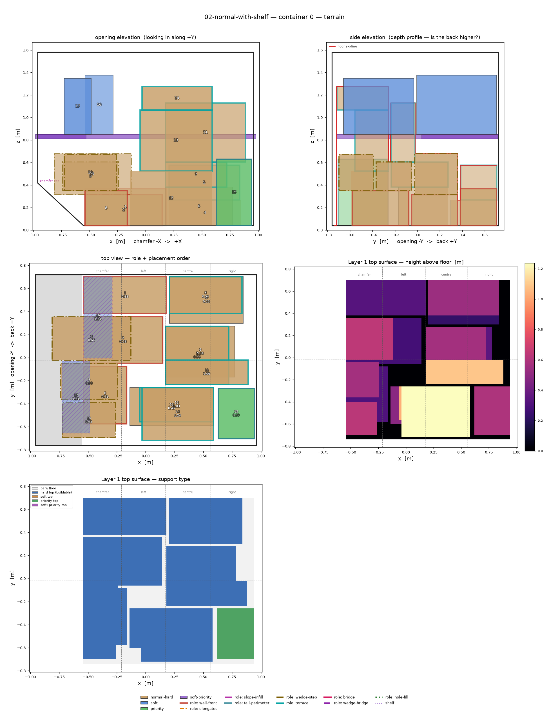

### container 0  (shelf=True, priority=False, placed=16)

| cell | coverage | mean h | max h | hard top m² | soft top m² | items | first step |
|---|---|---|---|---|---|---|---|
| `chamfer-back` | 0.958 | 0.541 | 0.603 | 0.2208 | 0.0000 | 2 | 6 |
| `left-back` | 0.847 | 0.495 | 0.603 | 0.2440 | 0.0000 | 2 | 1 |
| `centre-back` | 0.696 | 0.365 | 0.636 | 0.1904 | 0.0000 | 0 | — |
| `right-back` | 0.972 | 0.584 | 0.636 | 0.2660 | 0.0000 | 4 | 3 |
| `chamfer-front` | 0.299 | 0.166 | 0.564 | 0.0688 | 0.0000 | 0 | — |
| `left-front` | 0.375 | 0.168 | 0.564 | 0.0600 | 0.0000 | 0 | — |
| `centre-front` | 0.789 | 0.249 | 0.315 | 0.0000 | 0.0000 | 1 | 10 |
| `right-front` | 0.750 | 0.451 | 0.601 | 0.0000 | 0.0000 | 1 | 9 |

**normal-hard floor layer** — 4 items, 0.9426 m²; centroid (x=0.484, y=0.734) in normalised floor coordinates; back share 1.000, centre share 0.000; mean top height by depth third (front→back) [None, 0.331, 0.354].

**surface** — buildable 0.672 (1.4312 m², 4 pads), soft-capped 0.4692 m². Support area {'free-floor': 0.612, 'hard': 1.05, 'soft-only': 0.0, 'priority-only': 0.4692, 'soft+priority-only': 0.0}.  Height bands {'0.00-0.15': 0.612, '0.15-0.30': 0.0, '0.30-0.50': 0.37, '0.50-0.80': 1.1492, '0.80+': 0.0}.

**shelf** — {'has_shelf': True, 'headroom_m': 0.73, 'headroom_volume_m3': 1.425, 'shelf_area_m2': 1.952, 'shelf_volume_used_m3': 0.4753, 'shelf_fill_ratio': 0.334, 'shelf_items': 6, 'shelf_footprint_ratio': 0.61, 'max_used_height_m': 0.526, 'headroom_height_used_ratio': 0.721, 'back_share_of_shelf_area': 0.865, 'overflow_items': 2, 'overflow_volume_m3': 0.2047}

**access** — {'corridor': {'area_m2': 0.3264, 'free_ratio': 0.515, 'mean_height_m': 0.153, 'max_height_m': 0.315}, 'front_centre': {'area_m2': 0.2736, 'free_ratio': 0.211, 'mean_height_m': 0.249, 'max_height_m': 0.315}, 'approach': {'width_m': 1.48, 'median_clearance_m': 0.976, 'max_clearance_m': 1.54, 'width_over_0.30m': 1.48, 'width_over_0.50m': 1.46, 'width_over_0.70m': 1.46}, 'reach': {'0.00': {'reachable_ratio': 0.239, 'reachable_free_m2': 0.4808, 'reachable_back_ratio': 0.014}, '0.20': {'reachable_ratio': 0.239, 'reachable_free_m2': 0.4808, 'reachable_back_ratio': 0.014}, '0.40': {'reachable_ratio': 0.452, 'reachable_free_m2': 0.5916, 'reachable_back_ratio': 0.194}, '0.60': {'reachable_ratio': 0.597, 'reachable_free_m2': 0.6044, 'reachable_back_ratio': 0.38}}, 'clear_lane_width_m': 0.06, 'front_half_max_height_m': 0.601, 'back_half_mean_height_m': 0.494}

**tall structure** — 1 tall-perimeter items, back share 0.000, median step back — vs front 9.000.

| step | role | cell | height m | footprint m² | class |
|---|---|---|---|---|---|
| 1 | wall-front | `left-back` | 0.328 | 0.2315 | normal-hard |
| 3 | elongated | `right-back` | 0.380 | 0.2507 | normal-hard |
| 5 | elongated | `right-back` | 0.320 | 0.1953 | normal-hard |
| 6 | wall-front | `chamfer-back` | 0.341 | 0.2650 | normal-hard |
| 9 | tall-perimeter | `right-front` | 0.601 | 0.2052 | priority |

## 03-priority-plus-normal

Priority ULD (index 0) next to a normal ULD. Tests the routing rules: soft-only never enters the priority container, plain hard may but only inside its budget.

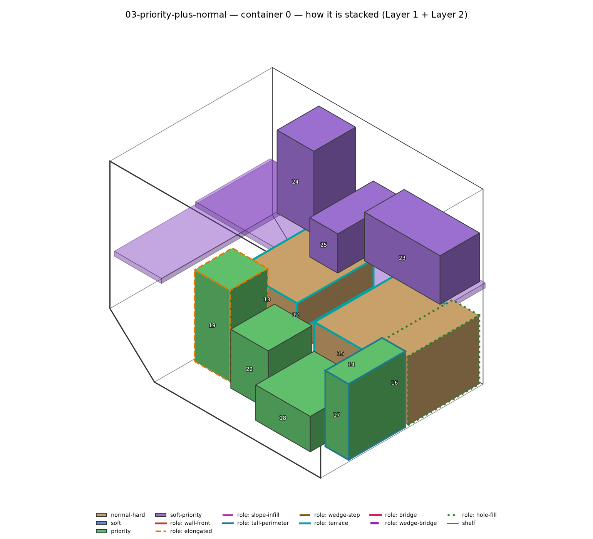
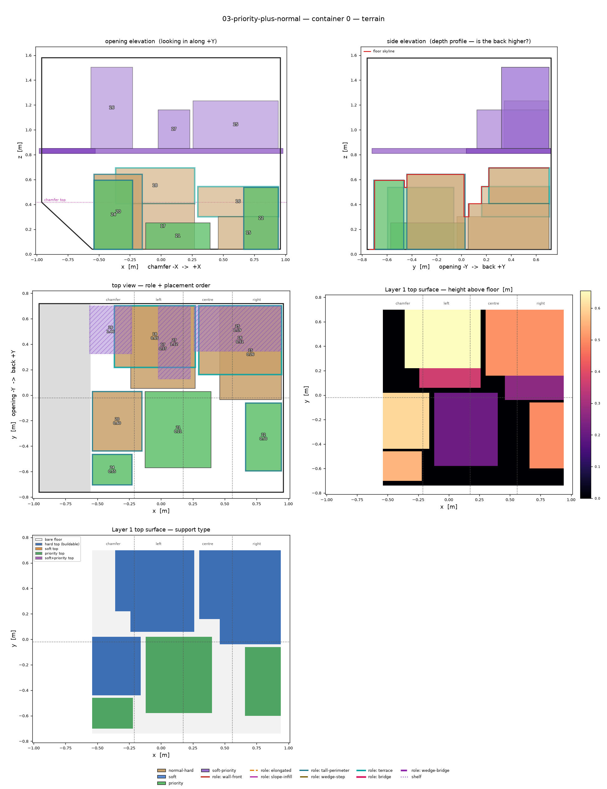
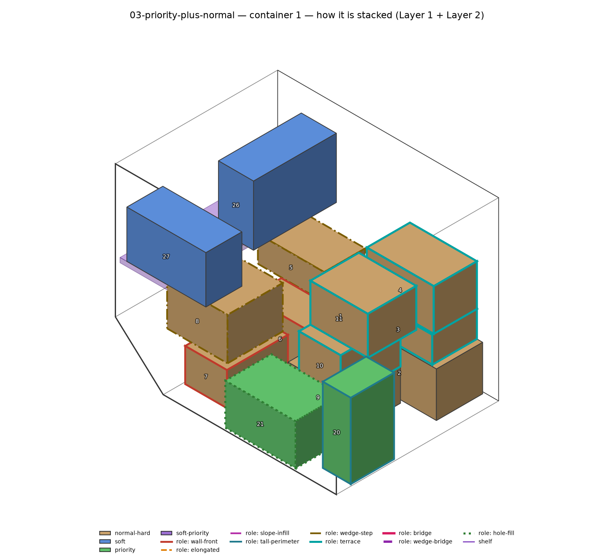
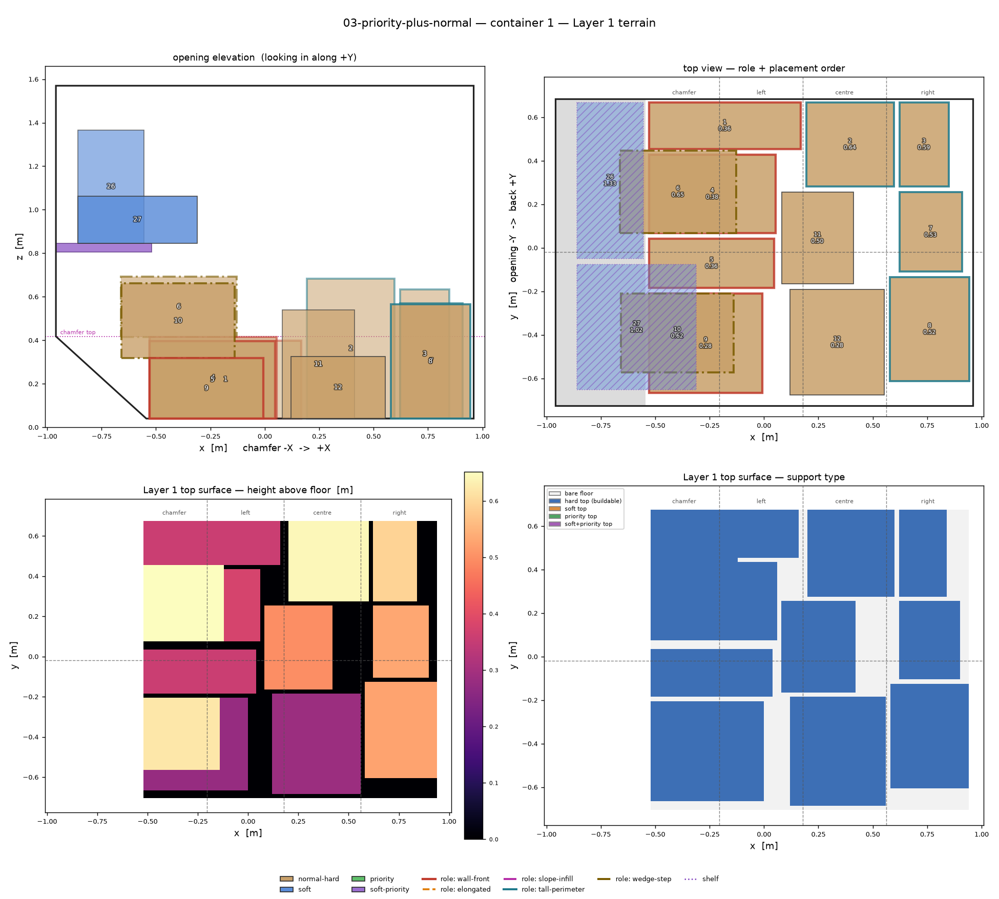

### container 0  (shelf=True, priority=True, placed=11)

| cell | coverage | mean h | max h | hard top m² | soft top m² | items | first step |
|---|---|---|---|---|---|---|---|
| `chamfer-back` | 0.361 | 0.230 | 0.655 | 0.0832 | 0.0000 | 0 | — |
| `left-back` | 0.897 | 0.523 | 0.655 | 0.2584 | 0.0000 | 2 | 17 |
| `centre-back` | 0.766 | 0.385 | 0.655 | 0.2096 | 0.0000 | 0 | — |
| `right-back` | 1.000 | 0.444 | 0.505 | 0.2736 | 0.0000 | 2 | 15 |
| `chamfer-front` | 0.917 | 0.477 | 0.602 | 0.1344 | 0.0000 | 2 | 20 |
| `left-front` | 0.371 | 0.159 | 0.602 | 0.0252 | 0.0000 | 0 | — |
| `centre-front` | 0.718 | 0.200 | 0.279 | 0.0020 | 0.0000 | 1 | 22 |
| `right-front` | 0.684 | 0.312 | 0.598 | 0.0076 | 0.0000 | 1 | 21 |

**normal-hard floor layer** — 3 items, 0.8688 m²; centroid (x=0.514, y=0.679) in normalised floor coordinates; back share 0.791, centre share 0.000; mean top height by depth third (front→back) [None, 0.602, 0.315].

**surface** — buildable 0.668 (1.4228 m², 4 pads), soft-capped 0.5324 m². Support area {'free-floor': 0.6048, 'hard': 0.994, 'soft-only': 0.0, 'priority-only': 0.5324, 'soft+priority-only': 0.0}.  Height bands {'0.00-0.15': 0.6048, '0.15-0.30': 0.366, '0.30-0.50': 0.2384, '0.50-0.80': 0.922, '0.80+': 0.0}.

**shelf** — {'has_shelf': True, 'headroom_m': 0.73, 'headroom_volume_m3': 1.425, 'shelf_area_m2': 1.952, 'shelf_volume_used_m3': 0.2242, 'shelf_fill_ratio': 0.157, 'shelf_items': 3, 'shelf_footprint_ratio': 0.268, 'max_used_height_m': 0.654, 'headroom_height_used_ratio': 0.896, 'back_share_of_shelf_area': 1.0, 'overflow_items': 3, 'overflow_volume_m3': 0.199}

**access** — {'corridor': {'area_m2': 0.3264, 'free_ratio': 0.455, 'mean_height_m': 0.171, 'max_height_m': 0.377}, 'front_centre': {'area_m2': 0.2736, 'free_ratio': 0.282, 'mean_height_m': 0.2, 'max_height_m': 0.279}, 'approach': {'width_m': 1.48, 'median_clearance_m': 1.163, 'max_clearance_m': 1.54, 'width_over_0.30m': 1.46, 'width_over_0.50m': 1.46, 'width_over_0.70m': 1.46}, 'reach': {'0.00': {'reachable_ratio': 0.117, 'reachable_free_m2': 0.2204, 'reachable_back_ratio': 0.008}, '0.20': {'reachable_ratio': 0.117, 'reachable_free_m2': 0.2204, 'reachable_back_ratio': 0.008}, '0.40': {'reachable_ratio': 0.484, 'reachable_free_m2': 0.4512, 'reachable_back_ratio': 0.212}, '0.60': {'reachable_ratio': 0.71, 'reachable_free_m2': 0.4552, 'reachable_back_ratio': 0.562}}, 'clear_lane_width_m': 0.08, 'front_half_max_height_m': 0.602, 'back_half_mean_height_m': 0.404}

**tall structure** — 2 tall-perimeter items, back share 0.000, median step back — vs front 22.000.

| step | role | cell | height m | footprint m² | class |
|---|---|---|---|---|---|
| 21 | tall-perimeter | `right-front` | 0.598 | 0.1098 | priority |
| 23 | tall-perimeter | `chamfer-front` | 0.377 | 0.1579 | priority |

### container 1  (shelf=False, priority=False, placed=18)

| cell | coverage | mean h | max h | hard top m² | soft top m² | items | first step |
|---|---|---|---|---|---|---|---|
| `chamfer-back` | 0.943 | 0.552 | 0.629 | 0.2112 | 0.0000 | 2 | 4 |
| `left-back` | 0.753 | 0.278 | 0.601 | 0.2004 | 0.0000 | 1 | 1 |
| `centre-back` | 1.000 | 1.474 | 1.474 | 0.2660 | 0.0000 | 6 | 2 |
| `right-back` | 0.734 | 0.858 | 1.474 | 0.1952 | 0.0000 | 0 | — |
| `chamfer-front` | 0.676 | 0.365 | 0.629 | 0.1472 | 0.0000 | 2 | 10 |
| `left-front` | 0.686 | 0.363 | 0.560 | 0.1772 | 0.0000 | 1 | 19 |
| `centre-front` | 0.559 | 0.546 | 1.112 | 0.1444 | 0.0000 | 2 | 7 |
| `right-front` | 0.559 | 0.621 | 1.112 | 0.1444 | 0.0000 | 1 | 14 |

**normal-hard floor layer** — 6 items, 1.1906 m²; centroid (x=0.399, y=0.605) in normalised floor coordinates; back share 0.689, centre share 0.387; mean top height by depth third (front→back) [0.56, 0.311, 0.374].

**surface** — buildable 0.743 (1.4968 m², 5 pads), soft-capped 0.0000 m². Support area {'free-floor': 0.5288, 'hard': 1.486, 'soft-only': 0.0, 'priority-only': 0.0, 'soft+priority-only': 0.0}.  Height bands {'0.00-0.15': 0.5288, '0.15-0.30': 0.0476, '0.30-0.50': 0.258, '0.50-0.80': 0.5088, '0.80+': 0.6716}.

**shelf** — {'has_shelf': True, 'headroom_m': 0.725, 'headroom_volume_m3': 0.437, 'shelf_area_m2': 0.6028, 'shelf_volume_used_m3': 0.247, 'shelf_fill_ratio': 0.565, 'shelf_items': 3, 'shelf_footprint_ratio': 0.928, 'max_used_height_m': 0.521, 'headroom_height_used_ratio': 0.719, 'back_share_of_shelf_area': 0.393, 'overflow_items': 0, 'overflow_volume_m3': 0}

**access** — {'corridor': {'area_m2': 0.3128, 'free_ratio': 0.379, 'mean_height_m': 0.427, 'max_height_m': 1.112}, 'front_centre': {'area_m2': 0.2584, 'free_ratio': 0.441, 'mean_height_m': 0.546, 'max_height_m': 1.112}, 'approach': {'width_m': 1.46, 'median_clearance_m': 0.901, 'max_clearance_m': 1.53, 'width_over_0.30m': 1.46, 'width_over_0.50m': 0.78, 'width_over_0.70m': 0.78}, 'reach': {'0.00': {'reachable_ratio': 0.191, 'reachable_free_m2': 0.3548, 'reachable_back_ratio': 0.007}, '0.20': {'reachable_ratio': 0.191, 'reachable_free_m2': 0.3548, 'reachable_back_ratio': 0.007}, '0.40': {'reachable_ratio': 0.241, 'reachable_free_m2': 0.3584, 'reachable_back_ratio': 0.049}, '0.60': {'reachable_ratio': 0.453, 'reachable_free_m2': 0.4468, 'reachable_back_ratio': 0.255}}, 'clear_lane_width_m': 0.06, 'front_half_max_height_m': 1.112, 'back_half_mean_height_m': 0.8}

**tall structure** — 0 tall-perimeter items, back share —, median step back — vs front —.

| step | role | cell | height m | footprint m² | class |
|---|---|---|---|---|---|
| 1 | wall-front | `left-back` | 0.359 | 0.1506 | normal-hard |
| 4 | wall-front | `chamfer-back` | 0.375 | 0.2089 | normal-hard |
| 10 | wall-front | `chamfer-front` | 0.344 | 0.1882 | normal-hard |

## 04-soft-heavy

Soft-dominated stream into a shelf ULD: shelf saturates early, the rest must cluster on the left soft strip.

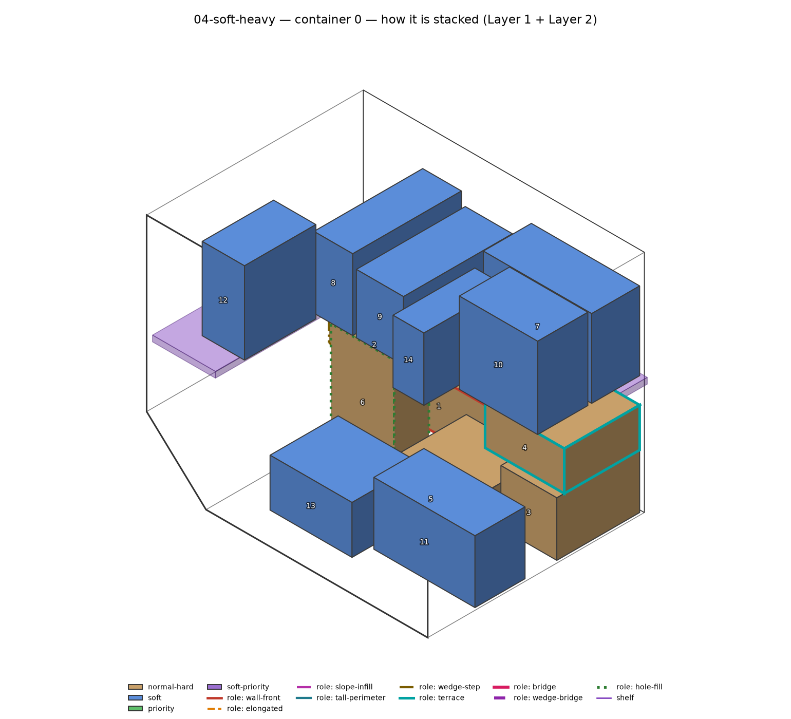
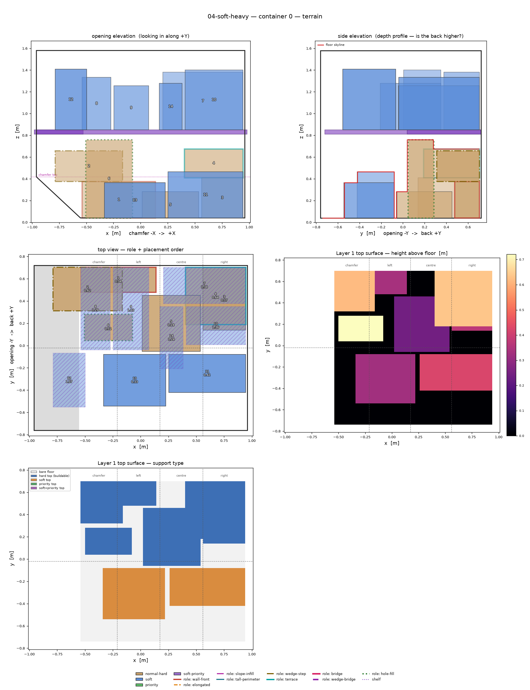

### container 0  (shelf=True, priority=False, placed=14)

| cell | coverage | mean h | max h | hard top m² | soft top m² | items | first step |
|---|---|---|---|---|---|---|---|
| `chamfer-back` | 0.972 | 0.457 | 0.617 | 0.1216 | 0.1024 | 1 | 2 |
| `left-back` | 0.575 | 0.190 | 0.617 | 0.1656 | 0.0000 | 1 | 1 |
| `centre-back` | 0.792 | 0.311 | 0.636 | 0.2168 | 0.0000 | 1 | 5 |
| `right-back` | 0.942 | 0.556 | 0.636 | 0.2128 | 0.0448 | 2 | 3 |
| `chamfer-front` | 0.556 | 0.164 | 0.295 | 0.0000 | 0.1280 | 1 | 14 |
| `left-front` | 0.511 | 0.121 | 0.241 | 0.1472 | 0.0000 | 0 | — |
| `centre-front` | 0.664 | 0.158 | 0.241 | 0.1816 | 0.0000 | 1 | 6 |
| `right-front` | 0.523 | 0.236 | 0.465 | 0.0088 | 0.1344 | 1 | 12 |

**normal-hard floor layer** — 4 items, 0.9447 m²; centroid (x=0.558, y=0.618) in normalised floor coordinates; back share 0.670, centre share 0.609; mean top height by depth third (front→back) [0.237, 0.241, 0.353].

**surface** — buildable 0.457 (0.9732 m², 4 pads), soft-capped 0.4096 m². Support area {'free-floor': 0.6672, 'hard': 1.0544, 'soft-only': 0.4096, 'priority-only': 0.0, 'soft+priority-only': 0.0}.  Height bands {'0.00-0.15': 0.6672, '0.15-0.30': 0.7784, '0.30-0.50': 0.2604, '0.50-0.80': 0.4252, '0.80+': 0.0}.

**shelf** — {'has_shelf': True, 'headroom_m': 0.73, 'headroom_volume_m3': 1.425, 'shelf_area_m2': 1.952, 'shelf_volume_used_m3': 0.5517, 'shelf_fill_ratio': 0.387, 'shelf_items': 6, 'shelf_footprint_ratio': 0.575, 'max_used_height_m': 0.558, 'headroom_height_used_ratio': 0.764, 'back_share_of_shelf_area': 0.874, 'overflow_items': 2, 'overflow_volume_m3': 0.1499}

**access** — {'corridor': {'area_m2': 0.3264, 'free_ratio': 0.458, 'mean_height_m': 0.128, 'max_height_m': 0.237}, 'front_centre': {'area_m2': 0.2736, 'free_ratio': 0.336, 'mean_height_m': 0.158, 'max_height_m': 0.241}, 'approach': {'width_m': 1.48, 'median_clearance_m': 1.299, 'max_clearance_m': 1.54, 'width_over_0.30m': 1.48, 'width_over_0.50m': 1.46, 'width_over_0.70m': 1.46}, 'reach': {'0.00': {'reachable_ratio': 0.239, 'reachable_free_m2': 0.48, 'reachable_back_ratio': 0.037}, '0.20': {'reachable_ratio': 0.239, 'reachable_free_m2': 0.48, 'reachable_back_ratio': 0.037}, '0.40': {'reachable_ratio': 0.716, 'reachable_free_m2': 0.6608, 'reachable_back_ratio': 0.552}, '0.60': {'reachable_ratio': 0.809, 'reachable_free_m2': 0.6672, 'reachable_back_ratio': 0.618}}, 'clear_lane_width_m': 0.12, 'front_half_max_height_m': 0.465, 'back_half_mean_height_m': 0.373}

**tall structure** — 0 tall-perimeter items, back share —, median step back — vs front —.

| step | role | cell | height m | footprint m² | class |
|---|---|---|---|---|---|
| 1 | wall-front | `left-back` | 0.335 | 0.1535 | normal-hard |

## 05-priority-heavy-no-priority-uld

Priority-dominated stream with no priority ULD: the priority edge zone on the right is the only home.

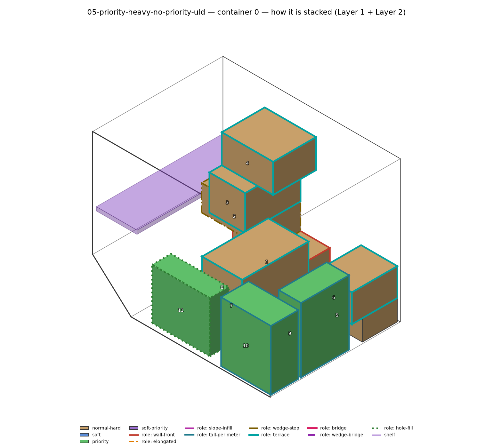
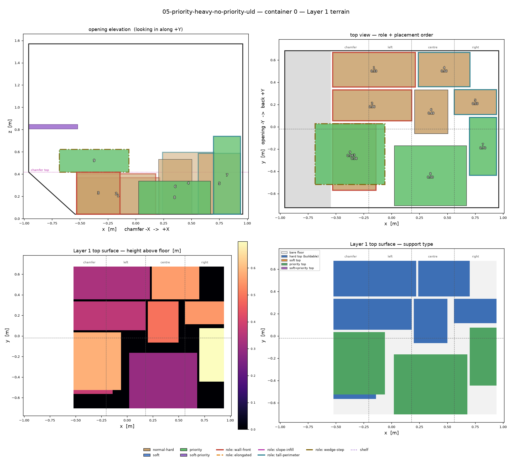

### container 0  (shelf=False, priority=False, placed=13)

| cell | coverage | mean h | max h | hard top m² | soft top m² | items | first step |
|---|---|---|---|---|---|---|---|
| `chamfer-back` | 0.964 | 1.121 | 1.273 | 0.2116 | 0.0000 | 2 | 5 |
| `left-back` | 0.977 | 1.035 | 1.273 | 0.2560 | 0.0000 | 3 | 1 |
| `centre-back` | 0.937 | 1.067 | 1.443 | 0.2492 | 0.0000 | 2 | 6 |
| `right-back` | 0.908 | 1.111 | 1.443 | 0.2128 | 0.0000 | 3 | 3 |
| `chamfer-front` | 0.688 | 0.172 | 0.250 | 0.0000 | 0.0000 | 1 | 13 |
| `left-front` | 0.870 | 0.235 | 0.493 | 0.0024 | 0.0000 | 0 | — |
| `centre-front` | 0.816 | 0.247 | 0.493 | 0.0056 | 0.0000 | 1 | 12 |
| `right-front` | 0.622 | 0.334 | 0.699 | 0.0000 | 0.0000 | 1 | 11 |

**normal-hard floor layer** — 4 items, 0.7032 m²; centroid (x=0.467, y=0.785) in normalised floor coordinates; back share 1.000, centre share 0.167; mean top height by depth third (front→back) [None, 0.436, 0.353].

**surface** — buildable 0.317 (0.6392 m², 2 pads), soft-capped 0.7752 m². Support area {'free-floor': 0.302, 'hard': 0.9376, 'soft-only': 0.0, 'priority-only': 0.7752, 'soft+priority-only': 0.0}.  Height bands {'0.00-0.15': 0.302, '0.15-0.30': 0.6504, '0.30-0.50': 0.104, '0.50-0.80': 0.1976, '0.80+': 0.7608}.

**shelf** — {'has_shelf': True, 'headroom_m': 0.725, 'headroom_volume_m3': 0.437, 'shelf_area_m2': 0.6028, 'shelf_volume_used_m3': 0, 'shelf_fill_ratio': 0.0, 'shelf_items': 0, 'shelf_footprint_ratio': 0.0, 'max_used_height_m': 0.0, 'headroom_height_used_ratio': 0.0, 'back_share_of_shelf_area': None, 'overflow_items': 3, 'overflow_volume_m3': 0.2698}

**access** — {'corridor': {'area_m2': 0.3128, 'free_ratio': 0.196, 'mean_height_m': 0.229, 'max_height_m': 0.297}, 'front_centre': {'area_m2': 0.2584, 'free_ratio': 0.184, 'mean_height_m': 0.247, 'max_height_m': 0.493}, 'approach': {'width_m': 1.46, 'median_clearance_m': 1.233, 'max_clearance_m': 1.53, 'width_over_0.30m': 1.46, 'width_over_0.50m': 1.46, 'width_over_0.70m': 1.46}, 'reach': {'0.00': {'reachable_ratio': 0.133, 'reachable_free_m2': 0.2396, 'reachable_back_ratio': 0.014}, '0.20': {'reachable_ratio': 0.133, 'reachable_free_m2': 0.2396, 'reachable_back_ratio': 0.014}, '0.40': {'reachable_ratio': 0.487, 'reachable_free_m2': 0.2912, 'reachable_back_ratio': 0.077}, '0.60': {'reachable_ratio': 0.536, 'reachable_free_m2': 0.2972, 'reachable_back_ratio': 0.175}}, 'clear_lane_width_m': 0.14, 'front_half_max_height_m': 0.699, 'back_half_mean_height_m': 1.082}

**tall structure** — 1 tall-perimeter items, back share 0.000, median step back — vs front 11.000.

| step | role | cell | height m | footprint m² | class |
|---|---|---|---|---|---|
| 1 | wall-front | `left-back` | 0.328 | 0.2308 | normal-hard |
| 5 | wall-front | `chamfer-back` | 0.379 | 0.1225 | normal-hard |
| 11 | tall-perimeter | `right-front` | 0.699 | 0.1258 | priority |

## 06-soft-priority-heavy

Soft+priority dominated stream with a priority shelf ULD present: SP should prefer the priority shelf, then cluster.

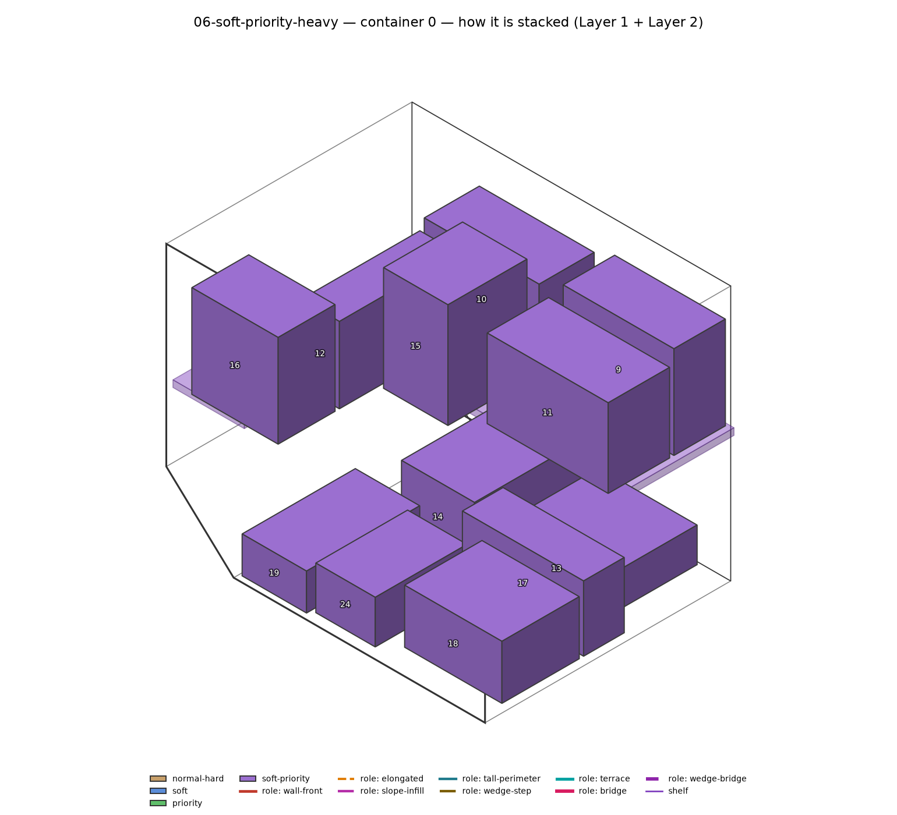
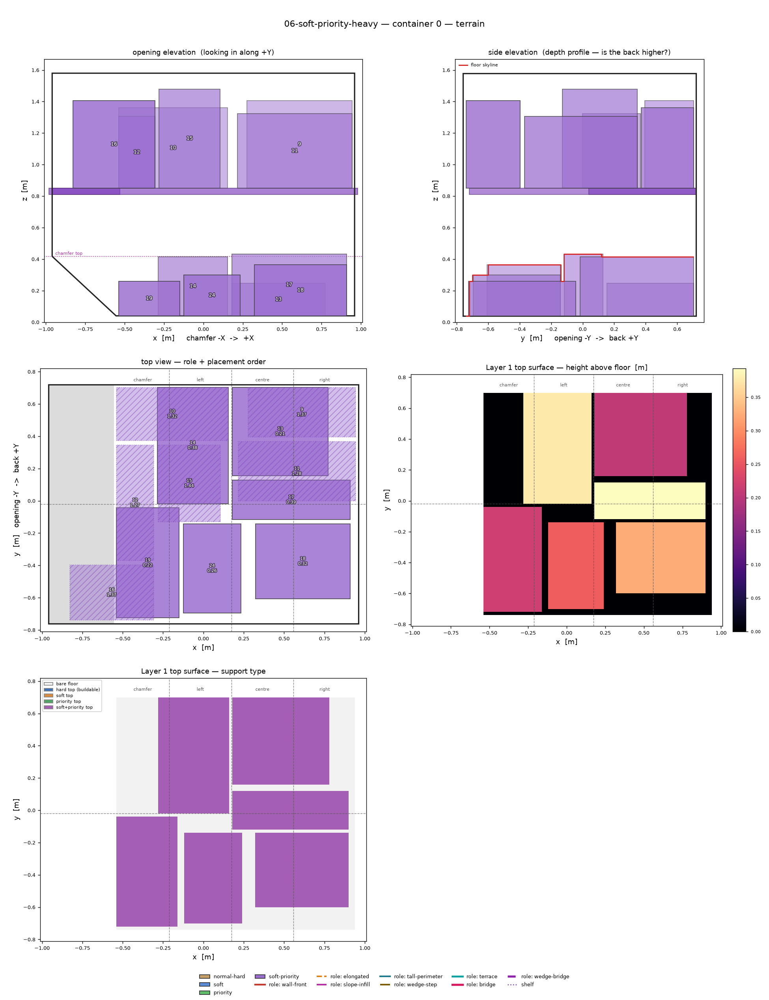
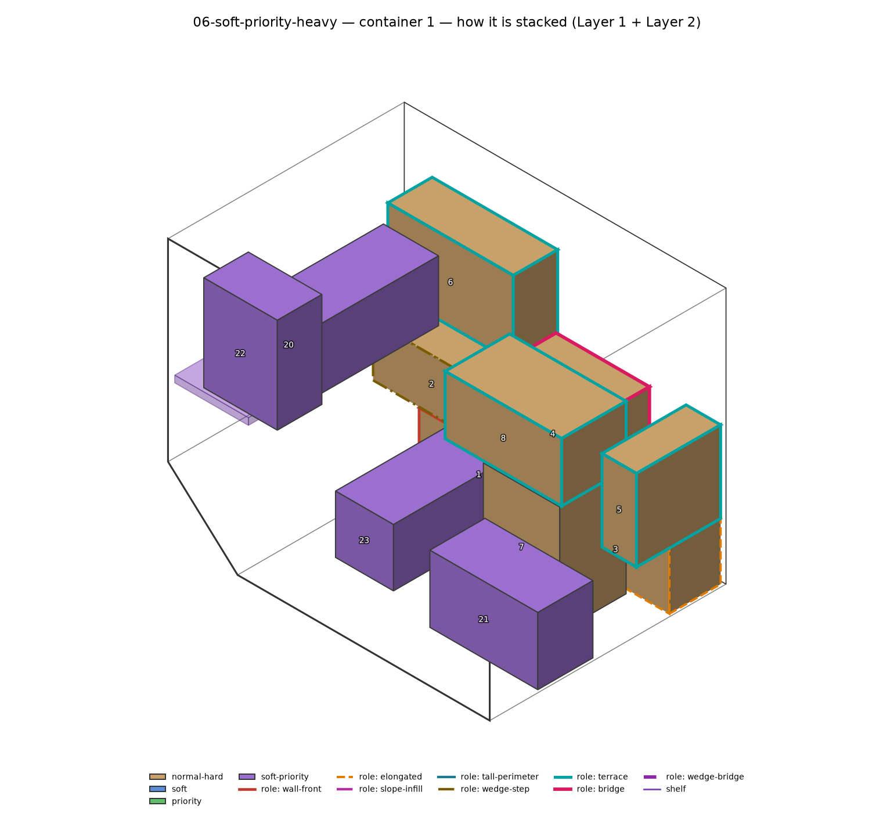
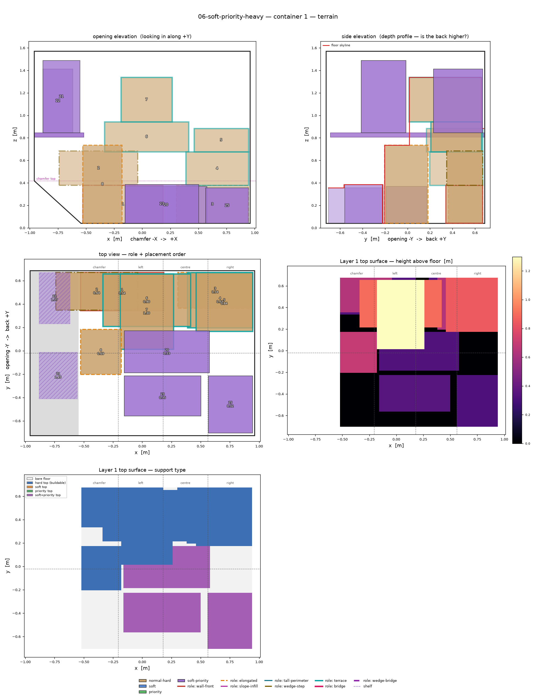

### container 0  (shelf=True, priority=True, placed=11)

| cell | coverage | mean h | max h | hard top m² | soft top m² | items | first step |
|---|---|---|---|---|---|---|---|
| `chamfer-back` | 0.497 | 0.156 | 0.324 | 0.0000 | 0.1144 | 0 | — |
| `left-back` | 0.696 | 0.212 | 0.324 | 0.0000 | 0.2004 | 1 | 18 |
| `centre-back` | 0.482 | 0.108 | 0.375 | 0.0000 | 0.1320 | 0 | — |
| `right-back` | 0.972 | 0.225 | 0.375 | 0.0000 | 0.2660 | 1 | 13 |
| `chamfer-front` | 0.252 | 0.055 | 0.219 | 0.0000 | 0.0580 | 0 | — |
| `left-front` | 0.786 | 0.178 | 0.245 | 0.0000 | 0.2264 | 1 | 19 |
| `centre-front` | 0.838 | 0.223 | 0.375 | 0.0000 | 0.2292 | 1 | 17 |
| `right-front` | 0.861 | 0.323 | 0.375 | 0.0000 | 0.2356 | 1 | 14 |

**normal-hard floor layer** — 0 items, 0.0000 m²; centroid (x=—, y=—) in normalised floor coordinates; back share —, centre share —; mean top height by depth third (front→back) [None, None, None].

**surface** — buildable 0.314 (0.6692 m², 1 pads), soft-capped 1.4620 m². Support area {'free-floor': 0.6692, 'hard': 0.0, 'soft-only': 0.0, 'priority-only': 0.0, 'soft+priority-only': 1.462}.  Height bands {'0.00-0.15': 0.6692, '0.15-0.30': 0.8784, '0.30-0.50': 0.5836, '0.50-0.80': 0.0, '0.80+': 0.0}.

**shelf** — {'has_shelf': True, 'headroom_m': 0.73, 'headroom_volume_m3': 1.425, 'shelf_area_m2': 1.952, 'shelf_volume_used_m3': 0.651, 'shelf_fill_ratio': 0.457, 'shelf_items': 6, 'shelf_footprint_ratio': 0.633, 'max_used_height_m': 0.63, 'headroom_height_used_ratio': 0.863, 'back_share_of_shelf_area': 0.856, 'overflow_items': 5, 'overflow_volume_m3': 0.4032}

**access** — {'corridor': {'area_m2': 0.3264, 'free_ratio': 0.255, 'mean_height_m': 0.183, 'max_height_m': 0.375}, 'front_centre': {'area_m2': 0.2736, 'free_ratio': 0.162, 'mean_height_m': 0.223, 'max_height_m': 0.375}, 'approach': {'width_m': 1.48, 'median_clearance_m': 1.295, 'max_clearance_m': 1.54, 'width_over_0.30m': 1.48, 'width_over_0.50m': 1.48, 'width_over_0.70m': 1.48}, 'reach': {'0.00': {'reachable_ratio': 0.221, 'reachable_free_m2': 0.4452, 'reachable_back_ratio': 0.123}, '0.20': {'reachable_ratio': 0.221, 'reachable_free_m2': 0.4452, 'reachable_back_ratio': 0.123}, '0.40': {'reachable_ratio': 1.0, 'reachable_free_m2': 0.6692, 'reachable_back_ratio': 1.0}, '0.60': {'reachable_ratio': 1.0, 'reachable_free_m2': 0.6692, 'reachable_back_ratio': 1.0}}, 'clear_lane_width_m': 0.26, 'front_half_max_height_m': 0.375, 'back_half_mean_height_m': 0.177}

**tall structure** — 0 tall-perimeter items, back share —, median step back — vs front —.

### container 1  (shelf=False, priority=False, placed=12)

| cell | coverage | mean h | max h | hard top m² | soft top m² | items | first step |
|---|---|---|---|---|---|---|---|
| `chamfer-back` | 0.698 | 0.624 | 1.262 | 0.1088 | 0.0476 | 2 | 2 |
| `left-back` | 0.958 | 0.764 | 1.262 | 0.1868 | 0.0680 | 2 | 1 |
| `centre-back` | 0.962 | 0.845 | 0.995 | 0.2560 | 0.0000 | 3 | 4 |
| `right-back` | 0.809 | 0.598 | 0.995 | 0.2152 | 0.0000 | 2 | 3 |
| `chamfer-front` | 0.206 | 0.071 | 0.343 | 0.0000 | 0.0448 | 0 | — |
| `left-front` | 0.260 | 0.097 | 0.995 | 0.0032 | 0.0640 | 0 | — |
| `centre-front` | 0.395 | 0.181 | 0.995 | 0.0136 | 0.0884 | 0 | — |
| `right-front` | 0.525 | 0.220 | 0.995 | 0.0064 | 0.1292 | 1 | 21 |

**normal-hard floor layer** — 3 items, 0.6099 m²; centroid (x=0.548, y=0.805) in normalised floor coordinates; back share 1.000, centre share 0.296; mean top height by depth third (front→back) [None, 0.646, 0.339].

**surface** — buildable 0.210 (0.4228 m², 2 pads), soft-capped 0.4420 m². Support area {'free-floor': 0.7828, 'hard': 0.79, 'soft-only': 0.0, 'priority-only': 0.0, 'soft+priority-only': 0.442}.  Height bands {'0.00-0.15': 0.7828, '0.15-0.30': 0.0, '0.30-0.50': 0.5376, '0.50-0.80': 0.026, '0.80+': 0.6684}.

**shelf** — {'has_shelf': True, 'headroom_m': 0.725, 'headroom_volume_m3': 0.437, 'shelf_area_m2': 0.6028, 'shelf_volume_used_m3': 0.1529, 'shelf_fill_ratio': 0.35, 'shelf_items': 2, 'shelf_footprint_ratio': 0.592, 'max_used_height_m': 0.568, 'headroom_height_used_ratio': 0.783, 'back_share_of_shelf_area': 0.673, 'overflow_items': 2, 'overflow_volume_m3': 0.1624}

**access** — {'corridor': {'area_m2': 0.3128, 'free_ratio': 0.817, 'mean_height_m': 0.07, 'max_height_m': 0.399}, 'front_centre': {'area_m2': 0.2584, 'free_ratio': 0.605, 'mean_height_m': 0.181, 'max_height_m': 0.995}, 'approach': {'width_m': 1.46, 'median_clearance_m': 1.131, 'max_clearance_m': 1.53, 'width_over_0.30m': 1.46, 'width_over_0.50m': 1.46, 'width_over_0.70m': 0.76}, 'reach': {'0.00': {'reachable_ratio': 0.359, 'reachable_free_m2': 0.6936, 'reachable_back_ratio': 0.074}, '0.20': {'reachable_ratio': 0.359, 'reachable_free_m2': 0.6936, 'reachable_back_ratio': 0.074}, '0.40': {'reachable_ratio': 0.625, 'reachable_free_m2': 0.7696, 'reachable_back_ratio': 0.27}, '0.60': {'reachable_ratio': 0.625, 'reachable_free_m2': 0.7696, 'reachable_back_ratio': 0.27}}, 'clear_lane_width_m': 0.2, 'front_half_max_height_m': 0.995, 'back_half_mean_height_m': 0.711}

**tall structure** — 0 tall-perimeter items, back share —, median step back — vs front —.

| step | role | cell | height m | footprint m² | class |
|---|---|---|---|---|---|
| 1 | wall-front | `left-back` | 0.338 | 0.2335 | normal-hard |
| 3 | elongated | `right-back` | 0.339 | 0.1958 | normal-hard |

## 07-elongated-heavy

Long thin cargo (rho 2.5-6): the structural exception path. Watch where the wall / corner preference sends them and which poses the tipping bands refuse.

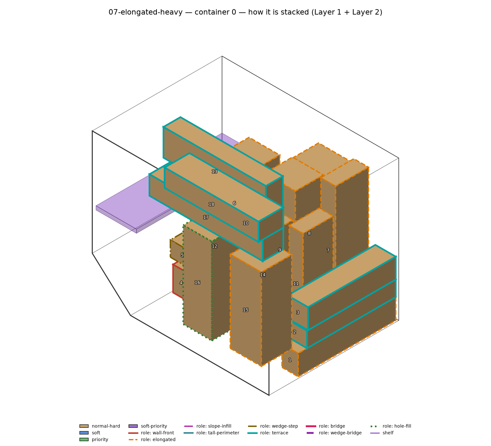
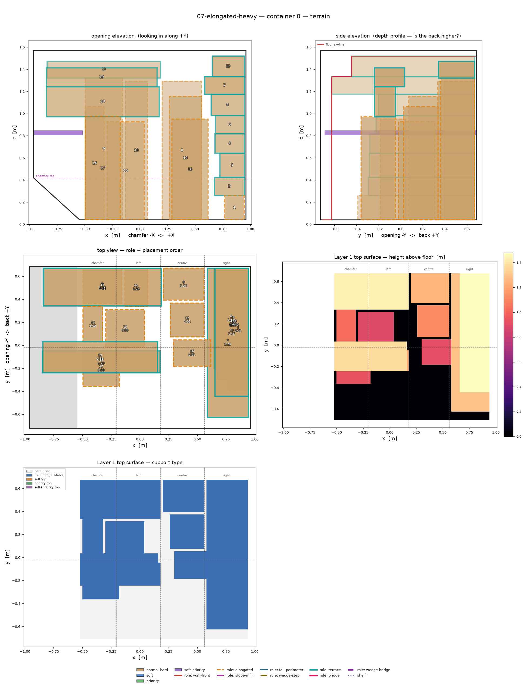

### container 0  (shelf=False, priority=False, placed=19)

| cell | coverage | mean h | max h | hard top m² | soft top m² | items | first step |
|---|---|---|---|---|---|---|---|
| `chamfer-back` | 0.900 | 0.826 | 1.253 | 0.2016 | 0.0000 | 4 | 5 |
| `left-back` | 0.738 | 0.955 | 1.446 | 0.1964 | 0.0000 | 3 | 10 |
| `centre-back` | 0.644 | 0.790 | 1.446 | 0.1712 | 0.0000 | 4 | 3 |
| `right-back` | 0.811 | 0.716 | 1.281 | 0.2156 | 0.0000 | 4 | 1 |
| `chamfer-front` | 0.564 | 0.459 | 1.113 | 0.1228 | 0.0000 | 0 | — |
| `left-front` | 0.884 | 1.264 | 1.446 | 0.2284 | 0.0000 | 2 | 13 |
| `centre-front` | 0.485 | 0.529 | 1.446 | 0.1252 | 0.0000 | 2 | 14 |
| `right-front` | 0.492 | 0.423 | 1.281 | 0.1272 | 0.0000 | 0 | — |

**normal-hard floor layer** — 12 items, 1.0259 m²; centroid (x=0.516, y=0.616) in normalised floor coordinates; back share 0.822, centre share 0.425; mean top height by depth third (front→back) [0.966, 0.951, 1.003].

**surface** — buildable 0.199 (0.4012 m², 2 pads), soft-capped 0.0000 m². Support area {'free-floor': 0.6264, 'hard': 1.3884, 'soft-only': 0.0, 'priority-only': 0.0, 'soft+priority-only': 0.0}.  Height bands {'0.00-0.15': 0.6264, '0.15-0.30': 0.0076, '0.30-0.50': 0.0176, '0.50-0.80': 0.088, '0.80+': 1.2752}.

**shelf** — {'has_shelf': True, 'headroom_m': 0.725, 'headroom_volume_m3': 0.437, 'shelf_area_m2': 0.6028, 'shelf_volume_used_m3': 0, 'shelf_fill_ratio': 0.0, 'shelf_items': 0, 'shelf_footprint_ratio': 0.0, 'max_used_height_m': 0.0, 'headroom_height_used_ratio': 0.0, 'back_share_of_shelf_area': None, 'overflow_items': 0, 'overflow_volume_m3': 0}

**access** — {'corridor': {'area_m2': 0.3128, 'free_ratio': 0.324, 'mean_height_m': 0.892, 'max_height_m': 1.446}, 'front_centre': {'area_m2': 0.2584, 'free_ratio': 0.515, 'mean_height_m': 0.529, 'max_height_m': 1.446}, 'approach': {'width_m': 1.46, 'median_clearance_m': 0.417, 'max_clearance_m': 1.53, 'width_over_0.30m': 0.82, 'width_over_0.50m': 0.7, 'width_over_0.70m': 0.16}, 'reach': {'0.00': {'reachable_ratio': 0.214, 'reachable_free_m2': 0.4024, 'reachable_back_ratio': 0.046}, '0.20': {'reachable_ratio': 0.214, 'reachable_free_m2': 0.4024, 'reachable_back_ratio': 0.046}, '0.40': {'reachable_ratio': 0.217, 'reachable_free_m2': 0.4024, 'reachable_back_ratio': 0.046}, '0.60': {'reachable_ratio': 0.226, 'reachable_free_m2': 0.4024, 'reachable_back_ratio': 0.06}}, 'clear_lane_width_m': 0.1, 'front_half_max_height_m': 1.446, 'back_half_mean_height_m': 0.821}

**tall structure** — 0 tall-perimeter items, back share —, median step back — vs front —.

| step | role | cell | height m | footprint m² | class |
|---|---|---|---|---|---|
| 1 | elongated | `right-back` | 0.220 | 0.1876 | normal-hard |
| 3 | elongated | `centre-back` | 0.953 | 0.0480 | normal-hard |
| 5 | wall-front | `chamfer-back` | 0.260 | 0.1457 | normal-hard |
| 7 | elongated | `centre-back` | 1.295 | 0.0573 | normal-hard |
| 8 | elongated | `centre-back` | 1.252 | 0.0992 | normal-hard |
| 9 | elongated | `centre-back` | 1.281 | 0.1028 | normal-hard |
| 10 | elongated | `left-back` | 1.253 | 0.0671 | normal-hard |
| 11 | elongated | `left-back` | 1.026 | 0.0497 | normal-hard |
| 12 | elongated | `left-back` | 1.116 | 0.0861 | normal-hard |
| 13 | elongated | `left-front` | 1.113 | 0.0537 | normal-hard |
| 14 | elongated | `centre-front` | 1.022 | 0.0532 | normal-hard |
| 16 | elongated | `centre-front` | 0.910 | 0.0754 | normal-hard |

## 08-slope-exploitation

Small low boxes that would fit the chamfer wedge if it were reachable. This scenario exists to show whether the slope pocket is usable at all from a floor layer.

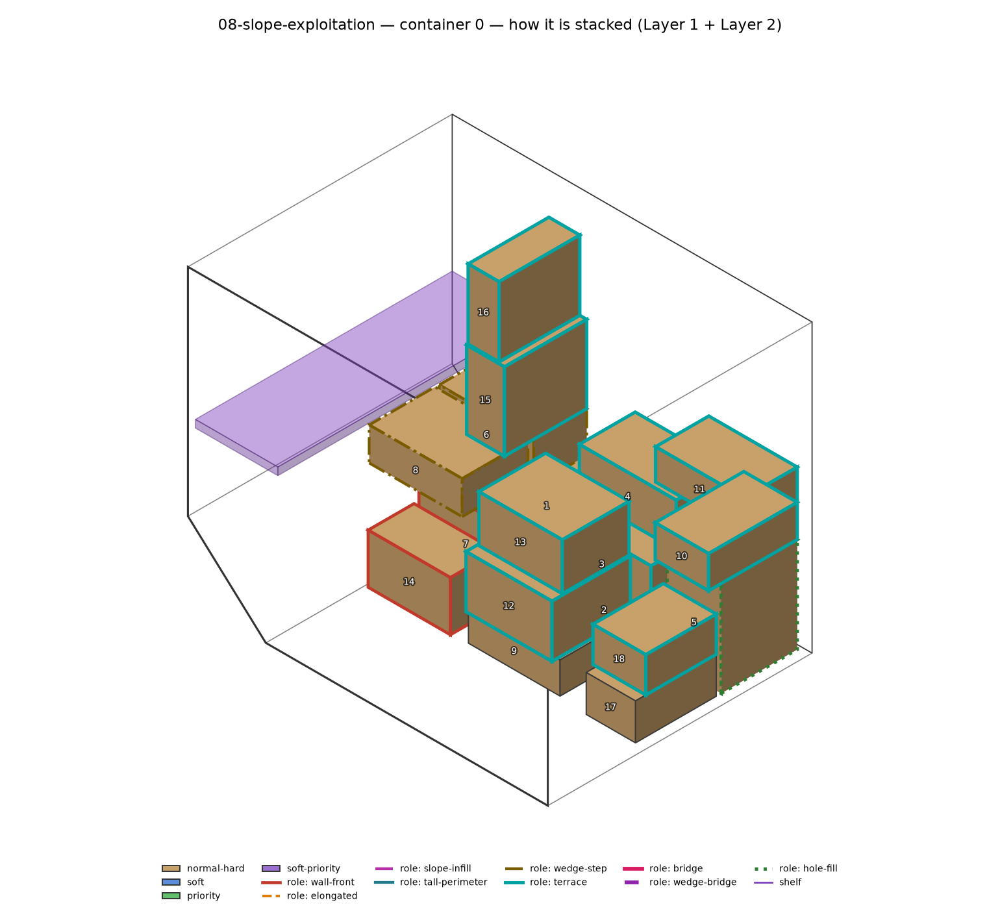
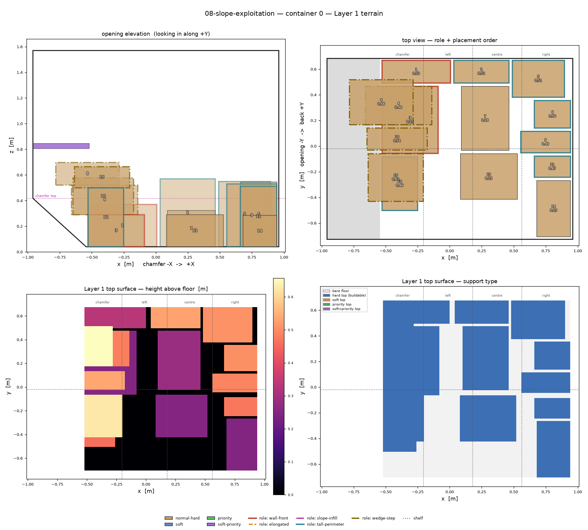

### container 0  (shelf=False, priority=False, placed=29)

| cell | coverage | mean h | max h | hard top m² | soft top m² | items | first step |
|---|---|---|---|---|---|---|---|
| `chamfer-back` | 0.945 | 0.784 | 1.382 | 0.2116 | 0.0000 | 5 | 1 |
| `left-back` | 0.830 | 0.759 | 1.478 | 0.2208 | 0.0000 | 4 | 20 |
| `centre-back` | 0.914 | 0.596 | 1.478 | 0.2432 | 0.0000 | 7 | 2 |
| `right-back` | 0.950 | 1.226 | 1.478 | 0.2528 | 0.0000 | 9 | 5 |
| `chamfer-front` | 0.423 | 0.207 | 0.650 | 0.0920 | 0.0000 | 3 | 10 |
| `left-front` | 0.223 | 0.147 | 1.478 | 0.0576 | 0.0000 | 0 | — |
| `centre-front` | 0.245 | 0.165 | 1.478 | 0.0632 | 0.0000 | 0 | — |
| `right-front` | 0.211 | 0.240 | 1.203 | 0.0544 | 0.0000 | 1 | 27 |

**normal-hard floor layer** — 7 items, 0.9482 m²; centroid (x=0.519, y=0.684) in normalised floor coordinates; back share 0.914, centre share 0.442; mean top height by depth third (front→back) [None, 0.302, 0.338].

**surface** — buildable 0.743 (1.4976 m², 6 pads), soft-capped 0.0000 m². Support area {'free-floor': 0.8192, 'hard': 1.1956, 'soft-only': 0.0, 'priority-only': 0.0, 'soft+priority-only': 0.0}.  Height bands {'0.00-0.15': 0.8192, '0.15-0.30': 0.0632, '0.30-0.50': 0.372, '0.50-0.80': 0.1956, '0.80+': 0.5648}.

**shelf** — {'has_shelf': True, 'headroom_m': 0.725, 'headroom_volume_m3': 0.437, 'shelf_area_m2': 0.6028, 'shelf_volume_used_m3': 0, 'shelf_fill_ratio': 0.0, 'shelf_items': 0, 'shelf_footprint_ratio': 0.0, 'max_used_height_m': 0.0, 'headroom_height_used_ratio': 0.0, 'back_share_of_shelf_area': None, 'overflow_items': 0, 'overflow_volume_m3': 0}

**access** — {'corridor': {'area_m2': 0.3128, 'free_ratio': 1.0, 'mean_height_m': 0.0, 'max_height_m': 0.0}, 'front_centre': {'area_m2': 0.2584, 'free_ratio': 0.755, 'mean_height_m': 0.165, 'max_height_m': 1.478}, 'approach': {'width_m': 1.46, 'median_clearance_m': 0.817, 'max_clearance_m': 1.53, 'width_over_0.30m': 1.16, 'width_over_0.50m': 0.78, 'width_over_0.70m': 0.78}, 'reach': {'0.00': {'reachable_ratio': 0.396, 'reachable_free_m2': 0.7692, 'reachable_back_ratio': 0.055}, '0.20': {'reachable_ratio': 0.415, 'reachable_free_m2': 0.7724, 'reachable_back_ratio': 0.077}, '0.40': {'reachable_ratio': 0.434, 'reachable_free_m2': 0.7796, 'reachable_back_ratio': 0.087}, '0.60': {'reachable_ratio': 0.549, 'reachable_free_m2': 0.7916, 'reachable_back_ratio': 0.21}}, 'clear_lane_width_m': 0.18, 'front_half_max_height_m': 1.478, 'back_half_mean_height_m': 0.843}

**tall structure** — 2 tall-perimeter items, back share 1.000, median step back 8.500 vs front —.

| step | role | cell | height m | footprint m² | class |
|---|---|---|---|---|---|
| 1 | wall-front | `chamfer-back` | 0.329 | 0.0952 | normal-hard |
| 4 | wall-front | `chamfer-back` | 0.298 | 0.1189 | normal-hard |
| 5 | tall-perimeter | `right-back` | 0.508 | 0.1169 | normal-hard |
| 10 | wall-front | `chamfer-front` | 0.285 | 0.0814 | normal-hard |
| 12 | tall-perimeter | `right-back` | 0.459 | 0.1162 | normal-hard |

## 09-mixed-random

Realistic mixed stream matching the official sample config class ratios.

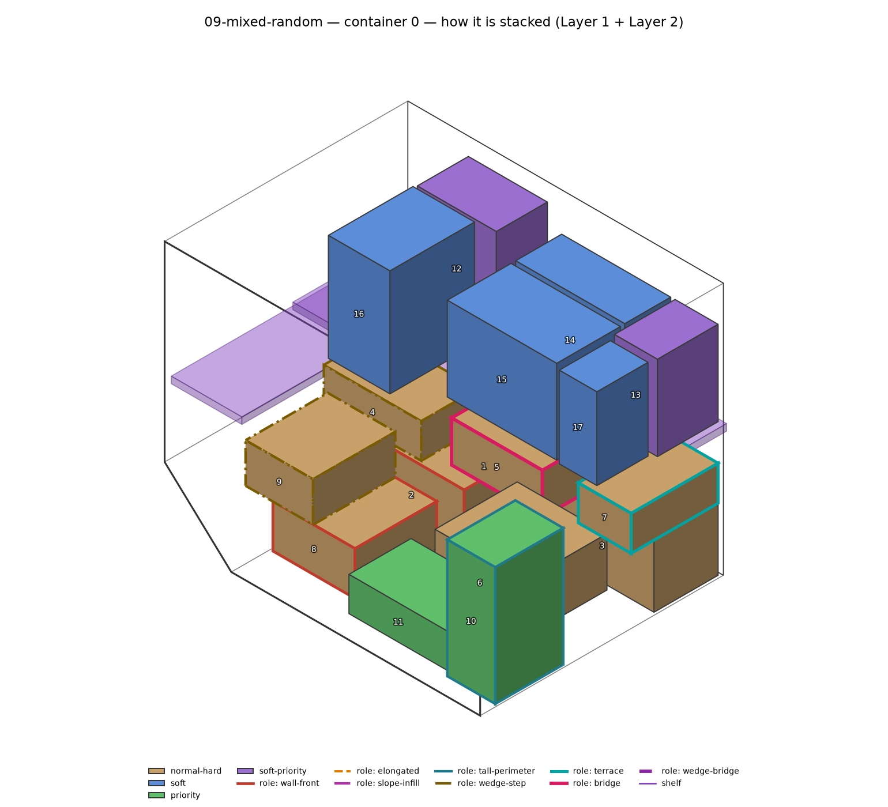
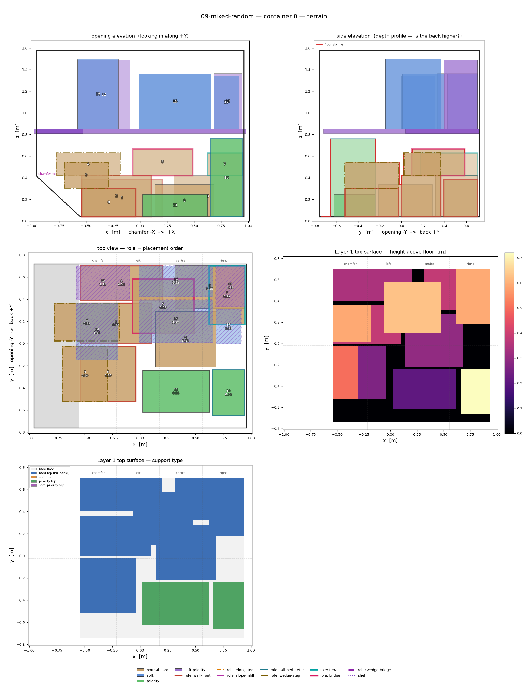

### container 0  (shelf=True, priority=False, placed=17)

| cell | coverage | mean h | max h | hard top m² | soft top m² | items | first step |
|---|---|---|---|---|---|---|---|
| `chamfer-back` | 0.917 | 0.432 | 0.589 | 0.2112 | 0.0000 | 2 | 2 |
| `left-back` | 0.922 | 0.450 | 0.628 | 0.2656 | 0.0000 | 1 | 1 |
| `centre-back` | 0.716 | 0.402 | 0.628 | 0.1960 | 0.0000 | 1 | 5 |
| `right-back` | 0.855 | 0.509 | 0.720 | 0.1892 | 0.0000 | 2 | 3 |
| `chamfer-front` | 0.377 | 0.086 | 0.229 | 0.0000 | 0.0000 | 0 | — |
| `left-front` | 0.807 | 0.177 | 0.229 | 0.0000 | 0.0000 | 1 | 10 |
| `centre-front` | 0.596 | 0.159 | 0.519 | 0.0000 | 0.0000 | 1 | 9 |
| `right-front` | 0.607 | 0.364 | 0.720 | 0.0000 | 0.0000 | 2 | 7 |

**normal-hard floor layer** — 3 items, 0.7109 m²; centroid (x=0.425, y=0.800) in normalised floor coordinates; back share 1.000, centre share 0.000; mean top height by depth third (front→back) [None, 0.38, 0.362].

**surface** — buildable 0.339 (0.7232 m², 4 pads), soft-capped 0.6932 m². Support area {'free-floor': 0.576, 'hard': 0.862, 'soft-only': 0.0, 'priority-only': 0.6932, 'soft+priority-only': 0.0}.  Height bands {'0.00-0.15': 0.576, '0.15-0.30': 0.4512, '0.30-0.50': 0.314, '0.50-0.80': 0.79, '0.80+': 0.0}.

**shelf** — {'has_shelf': True, 'headroom_m': 0.73, 'headroom_volume_m3': 1.425, 'shelf_area_m2': 1.952, 'shelf_volume_used_m3': 0.5717, 'shelf_fill_ratio': 0.401, 'shelf_items': 7, 'shelf_footprint_ratio': 0.612, 'max_used_height_m': 0.648, 'headroom_height_used_ratio': 0.888, 'back_share_of_shelf_area': 0.876, 'overflow_items': 4, 'overflow_volume_m3': 0.2558}

**access** — {'corridor': {'area_m2': 0.3264, 'free_ratio': 0.338, 'mean_height_m': 0.165, 'max_height_m': 0.519}, 'front_centre': {'area_m2': 0.2736, 'free_ratio': 0.404, 'mean_height_m': 0.159, 'max_height_m': 0.519}, 'approach': {'width_m': 1.48, 'median_clearance_m': 1.311, 'max_clearance_m': 1.54, 'width_over_0.30m': 1.48, 'width_over_0.50m': 1.48, 'width_over_0.70m': 1.48}, 'reach': {'0.00': {'reachable_ratio': 0.18, 'reachable_free_m2': 0.3532, 'reachable_back_ratio': 0.013}, '0.20': {'reachable_ratio': 0.18, 'reachable_free_m2': 0.3532, 'reachable_back_ratio': 0.013}, '0.40': {'reachable_ratio': 0.462, 'reachable_free_m2': 0.4028, 'reachable_back_ratio': 0.167}, '0.60': {'reachable_ratio': 0.73, 'reachable_free_m2': 0.5504, 'reachable_back_ratio': 0.517}}, 'clear_lane_width_m': 0.24, 'front_half_max_height_m': 0.72, 'back_half_mean_height_m': 0.449}

**tall structure** — 2 tall-perimeter items, back share 0.000, median step back — vs front 7.500.

| step | role | cell | height m | footprint m² | class |
|---|---|---|---|---|---|
| 1 | wall-front | `left-back` | 0.343 | 0.2322 | normal-hard |
| 2 | wall-front | `chamfer-back` | 0.380 | 0.2330 | normal-hard |
| 7 | tall-perimeter | `right-front` | 0.720 | 0.1209 | priority |
| 8 | tall-perimeter | `right-front` | 0.519 | 0.1362 | priority |

## 10-awkward-holes

Deliberately badly tiling sizes: the hole diagnostics scenario. Interior holes here are the point, not a bug.

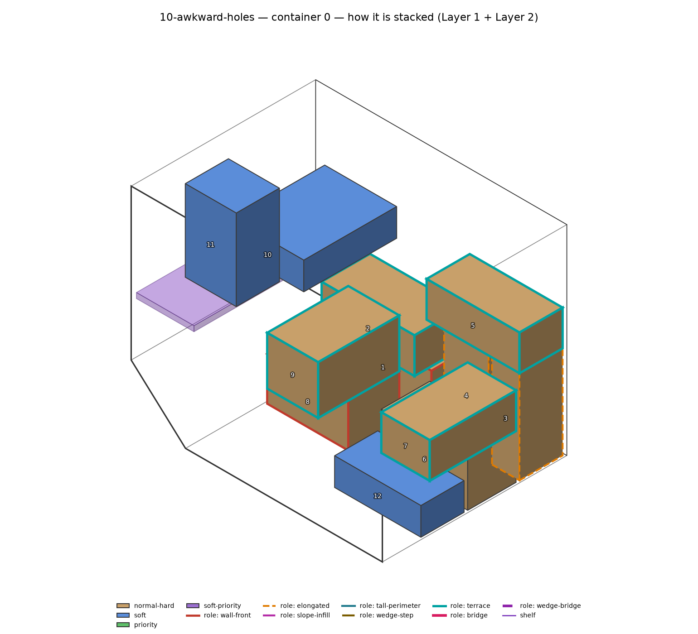
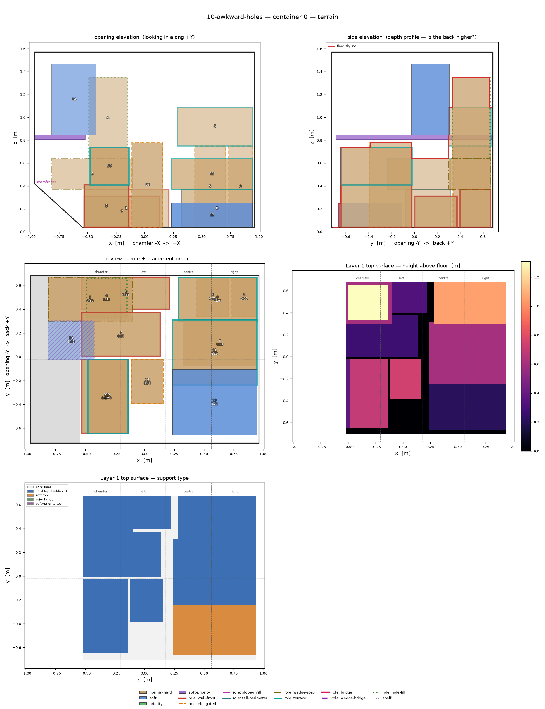

### container 0  (shelf=False, priority=False, placed=19)

| cell | coverage | mean h | max h | hard top m² | soft top m² | items | first step |
|---|---|---|---|---|---|---|---|
| `chamfer-back` | 0.984 | 0.808 | 1.280 | 0.2204 | 0.0000 | 0 | — |
| `left-back` | 1.000 | 1.280 | 1.280 | 0.2660 | 0.0000 | 5 | 1 |
| `centre-back` | 0.860 | 0.749 | 1.310 | 0.2288 | 0.0000 | 1 | 4 |
| `right-back` | 0.971 | 0.913 | 1.310 | 0.2584 | 0.0000 | 5 | 3 |
| `chamfer-front` | 0.912 | 0.560 | 1.280 | 0.1984 | 0.0000 | 2 | 9 |
| `left-front` | 0.712 | 0.687 | 1.470 | 0.1840 | 0.0000 | 0 | — |
| `centre-front` | 0.850 | 0.935 | 1.470 | 0.2196 | 0.0000 | 3 | 15 |
| `right-front` | 0.372 | 0.431 | 1.470 | 0.0960 | 0.0000 | 1 | 13 |

**normal-hard floor layer** — 7 items, 1.3665 m²; centroid (x=0.447, y=0.558) in normalised floor coordinates; back share 0.635, centre share 0.270; mean top height by depth third (front→back) [0.46, 0.3, 0.583].

**surface** — buildable 0.512 (1.0312 m², 4 pads), soft-capped 0.0000 m². Support area {'free-floor': 0.3432, 'hard': 1.6716, 'soft-only': 0.0, 'priority-only': 0.0, 'soft+priority-only': 0.0}.  Height bands {'0.00-0.15': 0.3432, '0.15-0.30': 0.054, '0.30-0.50': 0.0416, '0.50-0.80': 0.6332, '0.80+': 0.9428}.

**shelf** — {'has_shelf': True, 'headroom_m': 0.725, 'headroom_volume_m3': 0.437, 'shelf_area_m2': 0.6028, 'shelf_volume_used_m3': 0.1255, 'shelf_fill_ratio': 0.287, 'shelf_items': 2, 'shelf_footprint_ratio': 0.443, 'max_used_height_m': 0.62, 'headroom_height_used_ratio': 0.855, 'back_share_of_shelf_area': 0.0, 'overflow_items': 0, 'overflow_volume_m3': 0}

**access** — {'corridor': {'area_m2': 0.3128, 'free_ratio': 0.206, 'mean_height_m': 0.805, 'max_height_m': 1.47}, 'front_centre': {'area_m2': 0.2584, 'free_ratio': 0.15, 'mean_height_m': 0.935, 'max_height_m': 1.47}, 'approach': {'width_m': 1.46, 'median_clearance_m': 0.06, 'max_clearance_m': 0.89, 'width_over_0.30m': 0.46, 'width_over_0.50m': 0.18, 'width_over_0.70m': 0.18}, 'reach': {'0.00': {'reachable_ratio': 0.141, 'reachable_free_m2': 0.2552, 'reachable_back_ratio': 0.0}, '0.20': {'reachable_ratio': 0.141, 'reachable_free_m2': 0.2552, 'reachable_back_ratio': 0.0}, '0.40': {'reachable_ratio': 0.156, 'reachable_free_m2': 0.2552, 'reachable_back_ratio': 0.0}, '0.60': {'reachable_ratio': 0.215, 'reachable_free_m2': 0.2552, 'reachable_back_ratio': 0.0}}, 'clear_lane_width_m': 0.0, 'front_half_max_height_m': 1.47, 'back_half_mean_height_m': 0.943}

**tall structure** — 0 tall-perimeter items, back share —, median step back — vs front —.

| step | role | cell | height m | footprint m² | class |
|---|---|---|---|---|---|
| 1 | wall-front | `left-back` | 0.330 | 0.1998 | normal-hard |
| 3 | elongated | `right-back` | 0.710 | 0.0693 | normal-hard |
| 4 | elongated | `centre-back` | 0.710 | 0.1122 | normal-hard |
| 7 | wall-front | `left-back` | 0.270 | 0.2442 | normal-hard |
| 9 | wall-front | `chamfer-front` | 0.370 | 0.2418 | normal-hard |

## 11-lookahead-3

Same mix as 09 but with look_ahead=3, to see whether the pool ordering rule changes the board shape.

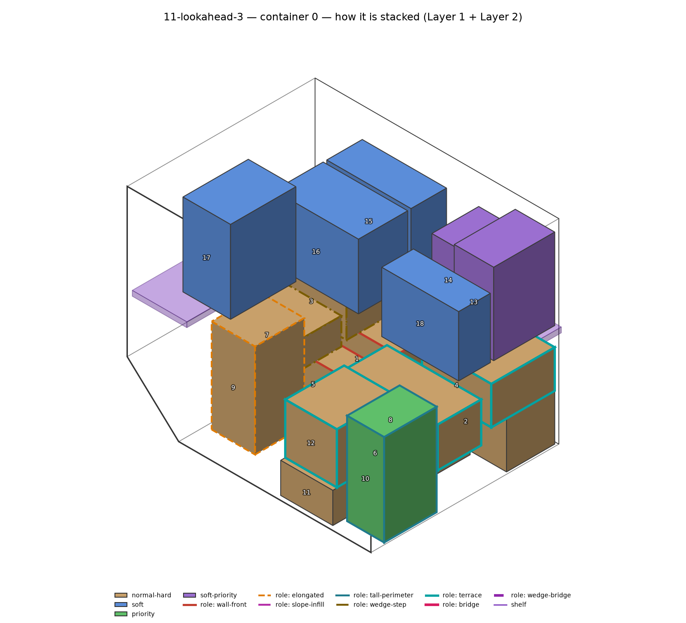
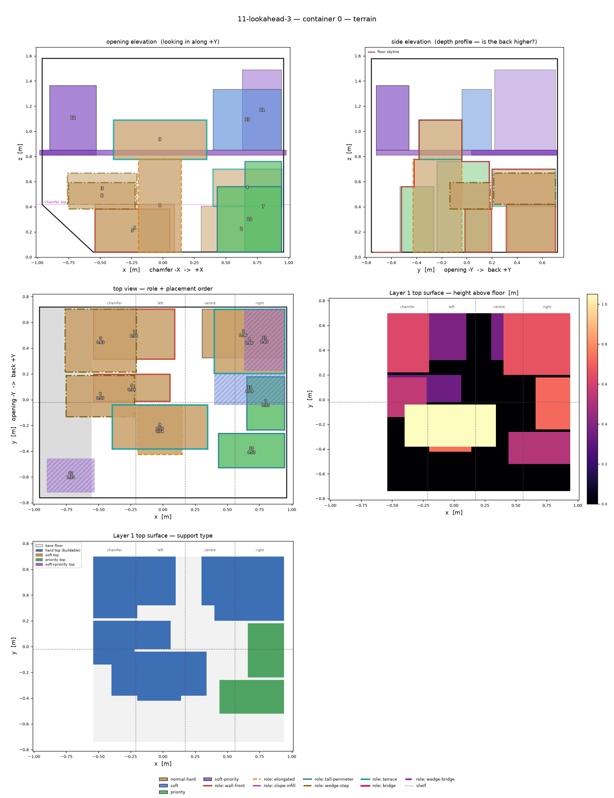

### container 0  (shelf=True, priority=False, placed=13)

| cell | coverage | mean h | max h | hard top m² | soft top m² | items | first step |
|---|---|---|---|---|---|---|---|
| `chamfer-back` | 0.972 | 0.581 | 0.628 | 0.2240 | 0.0000 | 4 | 1 |
| `left-back` | 0.643 | 0.244 | 0.628 | 0.1852 | 0.0000 | 0 | — |
| `centre-back` | 0.431 | 0.244 | 0.661 | 0.1180 | 0.0000 | 0 | — |
| `right-back` | 0.899 | 0.606 | 0.720 | 0.1900 | 0.0000 | 2 | 2 |
| `chamfer-front` | 0.354 | 0.328 | 1.051 | 0.0816 | 0.0000 | 0 | — |
| `left-front` | 0.519 | 0.531 | 1.051 | 0.1496 | 0.0000 | 2 | 8 |
| `centre-front` | 0.313 | 0.268 | 1.051 | 0.0544 | 0.0000 | 0 | — |
| `right-front` | 0.586 | 0.350 | 0.720 | 0.0000 | 0.0000 | 2 | 7 |

**normal-hard floor layer** — 4 items, 0.7455 m²; centroid (x=0.421, y=0.727) in normalised floor coordinates; back share 0.822, centre share 0.000; mean top height by depth third (front→back) [None, 0.539, 0.372].

**surface** — buildable 0.375 (0.7988 m², 4 pads), soft-capped 0.2476 m². Support area {'free-floor': 0.8808, 'hard': 1.0028, 'soft-only': 0.0, 'priority-only': 0.2476, 'soft+priority-only': 0.0}.  Height bands {'0.00-0.15': 0.8808, '0.15-0.30': 0.0, '0.30-0.50': 0.22, '0.50-0.80': 0.7788, '0.80+': 0.2516}.

**shelf** — {'has_shelf': True, 'headroom_m': 0.73, 'headroom_volume_m3': 1.425, 'shelf_area_m2': 1.952, 'shelf_volume_used_m3': 0.2072, 'shelf_fill_ratio': 0.145, 'shelf_items': 3, 'shelf_footprint_ratio': 0.192, 'max_used_height_m': 0.638, 'headroom_height_used_ratio': 0.874, 'back_share_of_shelf_area': 0.742, 'overflow_items': 2, 'overflow_volume_m3': 0.1577}

**access** — {'corridor': {'area_m2': 0.3264, 'free_ratio': 0.71, 'mean_height_m': 0.252, 'max_height_m': 1.051}, 'front_centre': {'area_m2': 0.2736, 'free_ratio': 0.687, 'mean_height_m': 0.268, 'max_height_m': 1.051}, 'approach': {'width_m': 1.48, 'median_clearance_m': 0.489, 'max_clearance_m': 1.54, 'width_over_0.30m': 1.46, 'width_over_0.50m': 0.72, 'width_over_0.70m': 0.72}, 'reach': {'0.00': {'reachable_ratio': 0.271, 'reachable_free_m2': 0.548, 'reachable_back_ratio': 0.029}, '0.20': {'reachable_ratio': 0.271, 'reachable_free_m2': 0.548, 'reachable_back_ratio': 0.029}, '0.40': {'reachable_ratio': 0.281, 'reachable_free_m2': 0.548, 'reachable_back_ratio': 0.05}, '0.60': {'reachable_ratio': 0.416, 'reachable_free_m2': 0.6576, 'reachable_back_ratio': 0.133}}, 'clear_lane_width_m': 0.1, 'front_half_max_height_m': 1.051, 'back_half_mean_height_m': 0.41}

**tall structure** — 2 tall-perimeter items, back share 0.000, median step back — vs front 8.500.

| step | role | cell | height m | footprint m² | class |
|---|---|---|---|---|---|
| 1 | wall-front | `chamfer-back` | 0.380 | 0.2457 | normal-hard |
| 5 | wall-front | `chamfer-back` | 0.341 | 0.1239 | normal-hard |
| 7 | tall-perimeter | `right-front` | 0.720 | 0.1209 | priority |
| 8 | elongated | `left-front` | 0.738 | 0.1327 | normal-hard |
| 10 | tall-perimeter | `right-front` | 0.519 | 0.1362 | priority |

## 12-large-hard-only

Only large plain hard cargo: the best case for the rectangular floor rule, and the flatness reference.

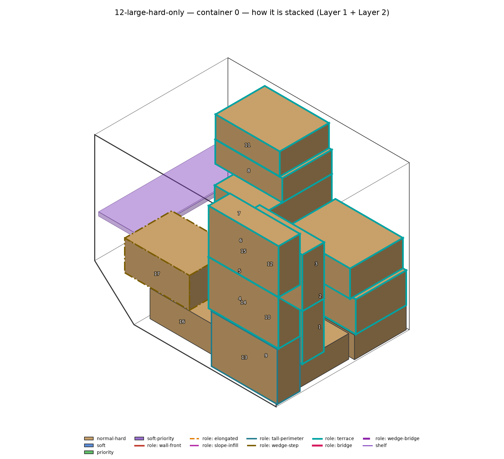
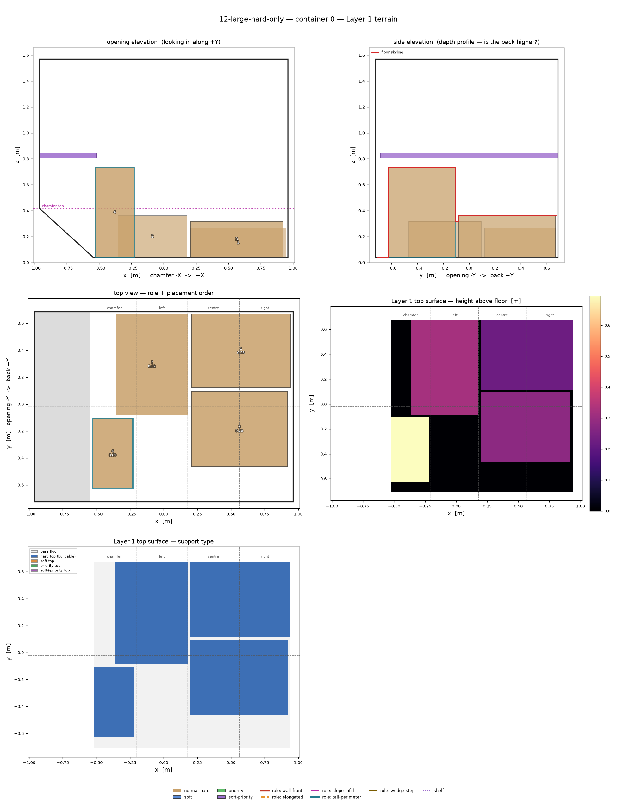

### container 0  (shelf=False, priority=False, placed=17)

| cell | coverage | mean h | max h | hard top m² | soft top m² | items | first step |
|---|---|---|---|---|---|---|---|
| `chamfer-back` | 0.900 | 1.259 | 1.483 | 0.2016 | 0.0000 | 1 | 11 |
| `left-back` | 0.947 | 1.283 | 1.483 | 0.2520 | 0.0000 | 5 | 4 |
| `centre-back` | 0.920 | 0.662 | 0.823 | 0.2448 | 0.0000 | 1 | 3 |
| `right-back` | 0.953 | 0.670 | 0.823 | 0.2536 | 0.0000 | 2 | 1 |
| `chamfer-front` | 0.767 | 0.470 | 1.032 | 0.1668 | 0.0000 | 1 | 17 |
| `left-front` | 0.752 | 0.314 | 1.032 | 0.1944 | 0.0000 | 1 | 16 |
| `centre-front` | 0.889 | 0.865 | 1.440 | 0.2296 | 0.0000 | 1 | 9 |
| `right-front` | 0.913 | 0.936 | 1.440 | 0.2360 | 0.0000 | 5 | 10 |

**normal-hard floor layer** — 5 items, 1.6740 m²; centroid (x=0.536, y=0.519) in normalised floor coordinates; back share 0.475, centre share 0.220; mean top height by depth third (front→back) [0.391, 0.235, 0.225].

**surface** — buildable 0.568 (1.1448 m², 4 pads), soft-capped 0.0000 m². Support area {'free-floor': 0.236, 'hard': 1.7788, 'soft-only': 0.0, 'priority-only': 0.0, 'soft+priority-only': 0.0}.  Height bands {'0.00-0.15': 0.236, '0.15-0.30': 0.3444, '0.30-0.50': 0.0, '0.50-0.80': 0.2588, '0.80+': 1.1756}.

**shelf** — {'has_shelf': True, 'headroom_m': 0.725, 'headroom_volume_m3': 0.437, 'shelf_area_m2': 0.6028, 'shelf_volume_used_m3': 0, 'shelf_fill_ratio': 0.0, 'shelf_items': 0, 'shelf_footprint_ratio': 0.0, 'max_used_height_m': 0.0, 'headroom_height_used_ratio': 0.0, 'back_share_of_shelf_area': None, 'overflow_items': 0, 'overflow_volume_m3': 0}

**access** — {'corridor': {'area_m2': 0.3128, 'free_ratio': 0.22, 'mean_height_m': 0.683, 'max_height_m': 1.44}, 'front_centre': {'area_m2': 0.2584, 'free_ratio': 0.111, 'mean_height_m': 0.865, 'max_height_m': 1.44}, 'approach': {'width_m': 1.46, 'median_clearance_m': 0.09, 'max_clearance_m': 1.53, 'width_over_0.30m': 0.72, 'width_over_0.50m': 0.2, 'width_over_0.70m': 0.2}, 'reach': {'0.00': {'reachable_ratio': 0.082, 'reachable_free_m2': 0.1376, 'reachable_back_ratio': 0.027}, '0.20': {'reachable_ratio': 0.082, 'reachable_free_m2': 0.1376, 'reachable_back_ratio': 0.027}, '0.40': {'reachable_ratio': 0.149, 'reachable_free_m2': 0.1428, 'reachable_back_ratio': 0.027}, '0.60': {'reachable_ratio': 0.281, 'reachable_free_m2': 0.1796, 'reachable_back_ratio': 0.056}}, 'clear_lane_width_m': 0.04, 'front_half_max_height_m': 1.44, 'back_half_mean_height_m': 0.957}

**tall structure** — 1 tall-perimeter items, back share 0.000, median step back — vs front 13.000.

| step | role | cell | height m | footprint m² | class |
|---|---|---|---|---|---|
| 13 | tall-perimeter | `right-front` | 0.503 | 0.1673 | normal-hard |

## 13-small-first-then-large

Small hard cargo first, large hard cargo after: does the follower rule stop the small boxes from carving up the bays the large ones still need?

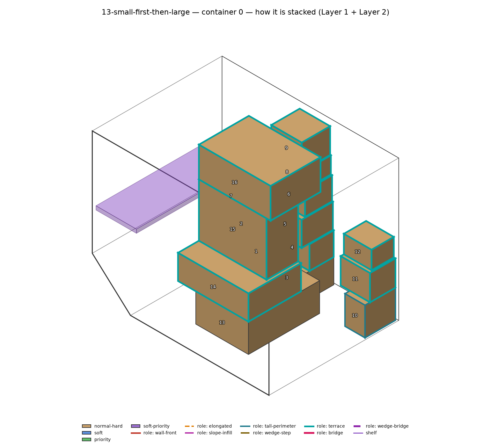
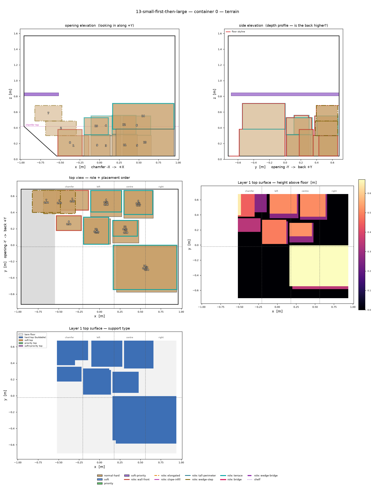

### container 0  (shelf=False, priority=False, placed=18)

| cell | coverage | mean h | max h | hard top m² | soft top m² | items | first step |
|---|---|---|---|---|---|---|---|
| `chamfer-back` | 0.864 | 0.405 | 0.643 | 0.1936 | 0.0000 | 5 | 1 |
| `left-back` | 0.847 | 0.498 | 1.480 | 0.2252 | 0.0000 | 4 | 3 |
| `centre-back` | 0.997 | 1.274 | 1.480 | 0.2652 | 0.0000 | 7 | 5 |
| `right-back` | 0.732 | 1.015 | 1.480 | 0.1948 | 0.0000 | 0 | — |
| `chamfer-front` | 1.000 | 0.625 | 0.625 | 0.2176 | 0.0000 | 1 | 18 |
| `left-front` | 0.793 | 0.312 | 1.480 | 0.2048 | 0.0000 | 1 | 17 |
| `centre-front` | 0.353 | 0.230 | 1.480 | 0.0912 | 0.0000 | 0 | — |
| `right-front` | 0.299 | 0.196 | 1.480 | 0.0772 | 0.0000 | 0 | — |

**normal-hard floor layer** — 7 items, 1.3437 m²; centroid (x=0.434, y=0.560) in normalised floor coordinates; back share 0.711, centre share 0.421; mean top height by depth third (front→back) [0.333, 0.305, 0.262].

**surface** — buildable 0.608 (1.2248 m², 3 pads), soft-capped 0.0000 m². Support area {'free-floor': 0.5452, 'hard': 1.4696, 'soft-only': 0.0, 'priority-only': 0.0, 'soft+priority-only': 0.0}.  Height bands {'0.00-0.15': 0.5452, '0.15-0.30': 0.0728, '0.30-0.50': 0.3288, '0.50-0.80': 0.5992, '0.80+': 0.4688}.

**shelf** — {'has_shelf': True, 'headroom_m': 0.725, 'headroom_volume_m3': 0.437, 'shelf_area_m2': 0.6028, 'shelf_volume_used_m3': 0, 'shelf_fill_ratio': 0.0, 'shelf_items': 0, 'shelf_footprint_ratio': 0.0, 'max_used_height_m': 0.0, 'headroom_height_used_ratio': 0.0, 'back_share_of_shelf_area': None, 'overflow_items': 0, 'overflow_volume_m3': 0}

**access** — {'corridor': {'area_m2': 0.3128, 'free_ratio': 0.65, 'mean_height_m': 0.123, 'max_height_m': 0.575}, 'front_centre': {'area_m2': 0.2584, 'free_ratio': 0.647, 'mean_height_m': 0.23, 'max_height_m': 1.48}, 'approach': {'width_m': 1.46, 'median_clearance_m': 0.05, 'max_clearance_m': 1.53, 'width_over_0.30m': 0.68, 'width_over_0.50m': 0.68, 'width_over_0.70m': 0.68}, 'reach': {'0.00': {'reachable_ratio': 0.235, 'reachable_free_m2': 0.4452, 'reachable_back_ratio': 0.043}, '0.20': {'reachable_ratio': 0.235, 'reachable_free_m2': 0.4452, 'reachable_back_ratio': 0.043}, '0.40': {'reachable_ratio': 0.336, 'reachable_free_m2': 0.4524, 'reachable_back_ratio': 0.086}, '0.60': {'reachable_ratio': 0.486, 'reachable_free_m2': 0.4668, 'reachable_back_ratio': 0.219}}, 'clear_lane_width_m': 0.08, 'front_half_max_height_m': 1.48, 'back_half_mean_height_m': 0.814}

**tall structure** — 0 tall-perimeter items, back share —, median step back — vs front —.

| step | role | cell | height m | footprint m² | class |
|---|---|---|---|---|---|
| 1 | wall-front | `chamfer-back` | 0.261 | 0.0950 | normal-hard |
| 9 | wall-front | `chamfer-back` | 0.331 | 0.0837 | normal-hard |

